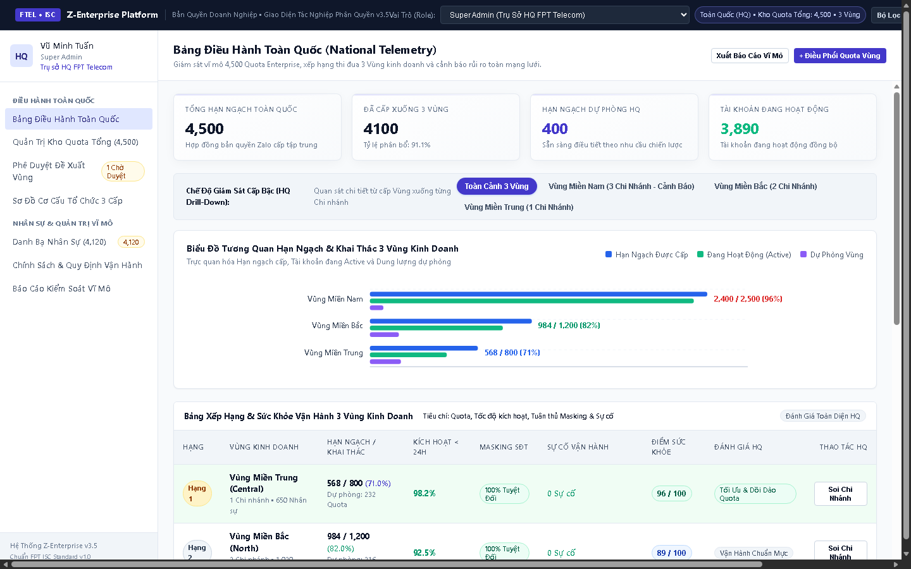
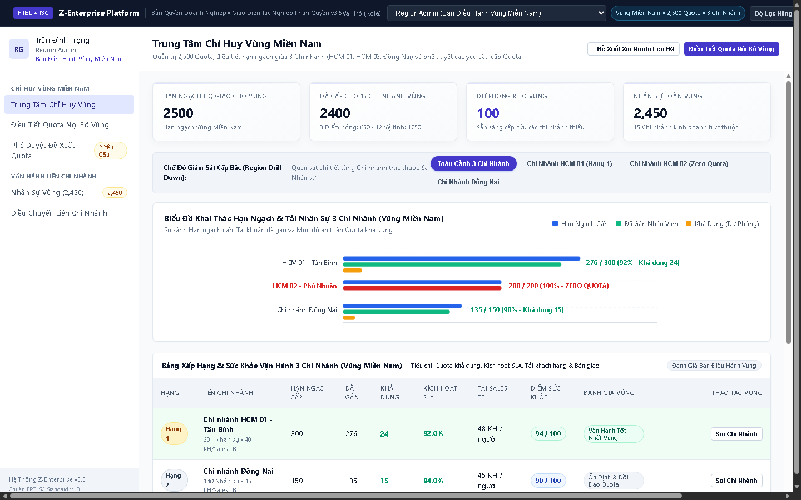
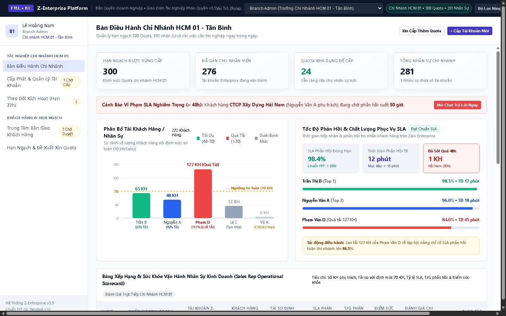
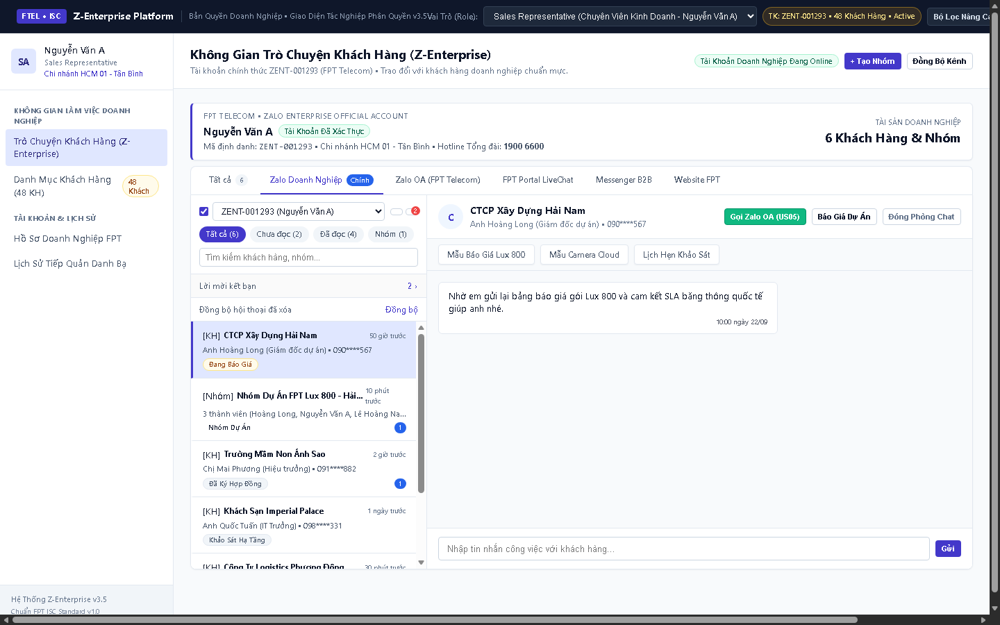
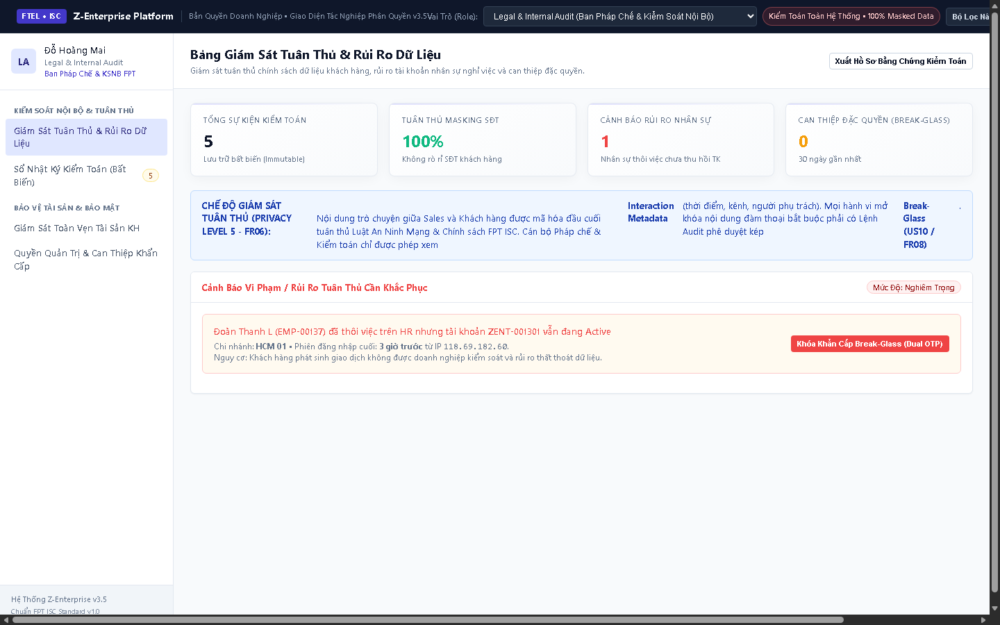

# Z-Enterprise Management Platform — Product Prototype

[](https://duythien2610.github.io/z-enterprise/)
[](docs/ISC_ZEnterprise_PRD_Standard_v1.0.md)
[](PROTOTYPE_SCOPE.md)

> **Bản mẫu tương tác độc lập (Executable Product Prototype v5.1 - Clean Minimalism)**  
> Nền Tảng Quản Trị Phân Phối Hạn Ngạch & Tác Nghiệp Bán Hàng Tập Trung dành cho Tập đoàn Viễn thông **FPT Telecom**.  
> **Trải nghiệm trực tiếp trên web:** [https://duythien2610.github.io/z-enterprise/](https://duythien2610.github.io/z-enterprise/)

---

## 1. HƯỚNG DẪN KÍCH HOẠT GITHUB PAGES (Chạy `github.io`)

Nếu bạn vừa đẩy repository này lên GitHub, hãy làm theo 3 bước đơn giản sau để kích hoạt đường dẫn `https://duythien2610.github.io/z-enterprise/`:

1. **Truy cập Cài đặt Repository trên GitHub:**
   - Vào link: [https://github.com/duythien2610/z-enterprise/settings/pages](https://github.com/duythien2610/z-enterprise/settings/pages)
2. **Cấu hình Nguồn xuất bản (Build and deployment):**
   - Tại mục **Source**, chọn: `Deploy from a branch`.
   - Tại mục **Branch**:
     - Chọn nhánh: `main` (hoặc `master`).
     - Chọn thư mục: `/ (root)`.
   - Nhấn nút **Save**.
3. **Đợi 1-2 phút để GitHub kích hoạt:**
   - GitHub Actions sẽ tự động biên dịch trang trong vòng 60 đến 120 giây.
   - Khi hoàn tất, truy cập trực tiếp tại:  
     👉 **[https://duythien2610.github.io/z-enterprise/](https://duythien2610.github.io/z-enterprise/)**

---

## 2. BỐ CỤC KIẾN TRÚC & 5 VAI TRÒ ĐIỀU HÀNH (RBAC ROLES)

Hệ thống mô phỏng đầy đủ 5 góc nhìn quản trị và tác nghiệp nghiệp vụ thực tế tại FPT Telecom:

```
┌────────────────────────────────────────────────────────────────────────────────────────┐
│                        Z-ENTERPRISE ROLE HIERARCHY & PURPOSES                          │
├────────────────────┬─────────────────────────────┬─────────────────────────────────────┤
│ VAI TRÒ            │ PHẠM VI QUẢN LÝ / TÁC NGHIỆP│ MỤC ĐÍCH & MỤC TIÊU CỐT LÕI         │
├────────────────────┼─────────────────────────────┼─────────────────────────────────────┤
│ 1. Super Admin     │ Trụ sở HQ (4,500 Quota Tổng)│ Giám sát vĩ mô, điều phối Quota     │
│    (Vũ Minh Tuấn)  │ Toàn quốc (3 Vùng)          │ 3 Vùng, hoạch định dự báo nhu cầu.  │
├────────────────────┼─────────────────────────────┼─────────────────────────────────────┤
│ 2. Region Admin    │ Vùng Miền Nam (2,500 Quota) │ Điều tiết Quota nội bộ Vùng, ứng cứu│
│    (Trần Đình Trọng)│ 15 Chi nhánh kinh doanh     │ chi nhánh cạn Quota (Zero Quota).   │
├────────────────────┼─────────────────────────────┼─────────────────────────────────────┤
│ 3. Branch Admin    │ Chi nhánh HCM 01 (300 Quota)│ Cấp tài khoản tự chủ bằng Email FPT,│
│    (Lê Hoàng Nam)  │ 281 Nhân sự • 272 KH        │ giám sát SLA, bàn giao khách hàng.  │
├────────────────────┼─────────────────────────────┼─────────────────────────────────────┤
│ 4. Sales Rep       │ Chi nhánh HCM 01            │ Tác nghiệp bán hàng B2B đa kênh,    │
│    (Nguyễn Văn A)  │ 48 Khách hàng B2B           │ gửi báo giá mẫu, gọi thoại bảo mật. │
├────────────────────┼─────────────────────────────┼─────────────────────────────────────┤
│ 5. Legal & Audit   │ Toàn hệ thống               │ Bảo vệ dữ liệu Privacy Level 5,     │
│    (Đỗ Hoàng Mai)  │ Giám sát tuân thủ 100%      │ phong tỏa tài khoản Break-Glass OTP.│
└────────────────────┴─────────────────────────────┴─────────────────────────────────────┘
```

---

## 3. ẢNH CHỤP GIAO DIỆN CÁC PHÂN HỆ (CLEAN MINIMALISM)

### 3.1. Super Admin — Bàn Điều Hành Vĩ Mô Toàn Quốc


### 3.2. Region Admin — Trung Tâm Chỉ Huy Vùng Miền Nam


### 3.3. Branch Admin — Bàn Điều Hành Chi Nhánh HCM 01 (Tân Bình)


### 3.4. Sales Representative — Không Gian Làm Việc Bán Hàng Đa Kênh


### 3.5. Legal & Internal Audit — Bảng Giám Sát Tuân Thủ & Khóa Khẩn Cấp Break-Glass


---

## 4. HƯỚNG DẪN 7 DEMO JOURNEYS NGHIỆP VỤ

### 🎯 Journey 1: Cưỡng Chế Thu Hồi Quota Nhàn Rỗi (Pull Model - US02, FR01)
1. Chọn vai trò **Region Admin (Vùng Miền Nam)**.
2. Tại bảng benchmark chi nhánh, quan sát **Chi nhánh Đồng Nai** có 15 Quota tự do.
3. Bấm nút **"Thu Hồi Về Kho Vùng"** $\rightarrow$ Hệ thống tự động chuyển Quota về kho Vùng.

### 🎯 Journey 2: Ứng Cứu Chi Nhánh Zero Quota
1. Tại màn hình **Region Admin**, nhận thấy **Chi nhánh HCM 02 - Phú Nhuận** đang có nhãn cảnh báo đỏ `ZERO QUOTA` (0 Quota khả dụng, 5 nhân sự chờ cấp tài khoản).
2. Nhấp vào nút màu đỏ **"Bơm Cấp 20 Quota Ngay"**.
3. Kho dự phòng Vùng lập tức giảm 20, Quota HCM 02 tăng lên 20 và nhãn cảnh báo đỏ biến mất.

### 🎯 Journey 3: Cấp Tài Khoản Tự Chủ & Tạm Khóa (AC-03b $\ge 10$ Ký Tự)
1. Chuyển sang vai trò **Branch Admin (HCM 01)**.
2. Bấm **"+ Cấp Tài Khoản Mới"** $\rightarrow$ Nhập thông tin với Email `@fpt.com.vn` $\rightarrow$ Nhấn Tạo. Quota khả dụng chi nhánh giảm 1 theo thời gian thực.
3. Trên dòng nhân sự `Nguyễn Văn A`, bấm **"Tạm Khóa"**:
   - Thử nhập dưới 10 ký tự: Bị hệ thống chặn theo quy tắc `AC-03b`.
   - Nhập đủ $\ge 10$ ký tự: Khóa thành công, toàn bộ phiên làm việc của Sales bị ngắt kết nối tức thì.

### 🎯 Journey 4: Bàn Giao Danh Bạ Kèm Bot Chào Tự Động (US07 / FR07)
1. Tại danh sách nhân sự của **Branch Admin**, tìm nhân viên `Phạm Văn D` (127 KH, sắp nghỉ việc).
2. Bấm **"Bàn Giao Kèm Bot Chào"** $\rightarrow$ Chọn người tiếp nhận `Trần Thị B`.
3. Bấm **"Thực Hiện Bàn Giao & Kích Hoạt Bot (<= 5 tin/s)"**.
4. Quan sát thanh tiến trình chạy với tốc độ điều tiết $\le 5$ tin/giây chống Spam Zalo. Sau khi xong, tài khoản cũ được lưu trữ (`ARCHIVED`) và chi nhánh được hoàn trả lại 1 Quota.

### 🎯 Journey 5: Tác Nghiệp Bán Hàng & Gọi Thoại 1-1 Zalo OA (US05)
1. Chuyển sang vai trò **Sales Rep (Nguyễn Văn A)**.
2. Trải nghiệm thanh Omnichannel Ribbon 6 kênh, nhấp vào các chip mẫu tin nhắn nhanh (*Mẫu Báo Giá Lux 800, Camera Cloud*).
3. Bấm **"Gọi Zalo OA (US05)"** $\rightarrow$ Trải nghiệm cuộc gọi thoại bảo mật có ghi nhận Siêu dữ liệu đàm thoại (Interaction Metadata) mà không ghi âm lén.

### 🎯 Journey 6: Giám Sát Tuân Thủ Privacy Level 5 (FR06)
1. Quan sát danh bạ của Sales và các bảng Admin: 100% số điện thoại khách hàng đều được che số dạng `090****567`.
2. Admin hoàn toàn không có quyền đọc trộm tin nhắn riêng tư thường nhật của Sales.

### 🎯 Journey 7: Mở Khóa Khẩn Cấp Break-Glass Xác Thực Kép Dual OTP (US10 / FR08)
1. Chuyển sang vai trò **Legal & Audit**.
2. Quan sát cảnh báo đỏ: *Nhân sự Đoàn Thanh L đã nghỉ việc trên HR nhưng tài khoản Z-Enterprise vẫn mở*.
3. Nhấp nút **"Khóa Khẩn Cấp Break-Glass (Dual OTP)"**.
4. Nhập mã hồ sơ thanh tra và mã OTP bảo mật 6 số từ Token Ban Kiểm toán $\rightarrow$ Bấm xác nhận để cưỡng chế phong tỏa tài khoản trên toàn quốc.

---

## 5. THƯ MỤC TÀI LIỆU CHI TIẾT (DOCS)

Toàn bộ hồ sơ tài liệu đặc tả chuẩn Business Analysis của dự án được lưu trữ trong thư mục [`docs/`](docs/):
* **[ISC_ZEnterprise_PRD_Standard_v1.0.md](docs/ISC_ZEnterprise_PRD_Standard_v1.0.md):** Bản Đặc tả Yêu cầu Sản phẩm (PRD) 4 phần chuẩn FPT ISC Standard.
* **[ISC_ZEnterprise_User_Guide_Standard_v1.0.md](docs/ISC_ZEnterprise_User_Guide_Standard_v1.0.md):** Sổ tay Hướng dẫn sử dụng và Quy tắc nghiệp vụ (Business Rules) chi tiết cho từng Role.
* **[PROTOTYPE_SCOPE.md](PROTOTYPE_SCOPE.md):** Phạm vi bản mẫu giao diện Clean Minimalism v5.1.
* **[PROTOTYPE_REVIEW.md](PROTOTYPE_REVIEW.md):** Báo cáo kiểm định chất lượng hiển thị 1440 × 900 px.
* **[PROTOTYPE_TRACEABILITY.md](PROTOTYPE_TRACEABILITY.md):** Ma trận truy vết yêu cầu (Traceability Matrix RTM).
* **[z-enterprise.zip](docs/z-enterprise.zip):** Gói nén trọn bộ mã nguồn và tài liệu dự án.

---

## 6. KHỞI CHẠY CỤC BỘ TRÊN MÁY TÍNH (OFFLINE LOCAL)

Nếu muốn chạy offline không cần Internet:
```powershell
# Chạy trực tiếp bằng Python
python -m http.server 8080

# Hoặc dùng Node.js
npx serve -l 8080 .
```
Mở trình duyệt tại `http://localhost:8080`.
