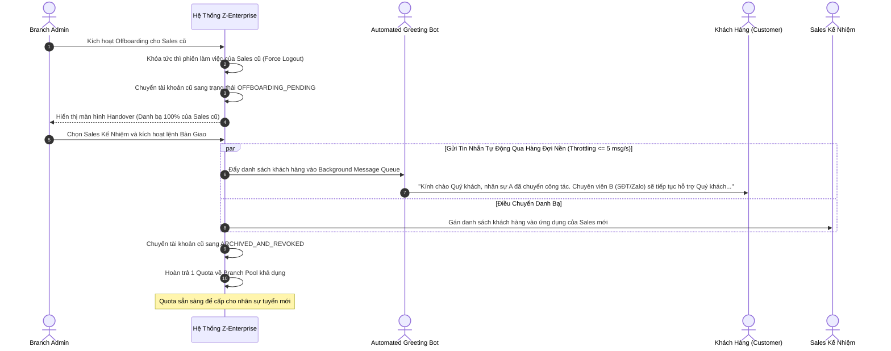
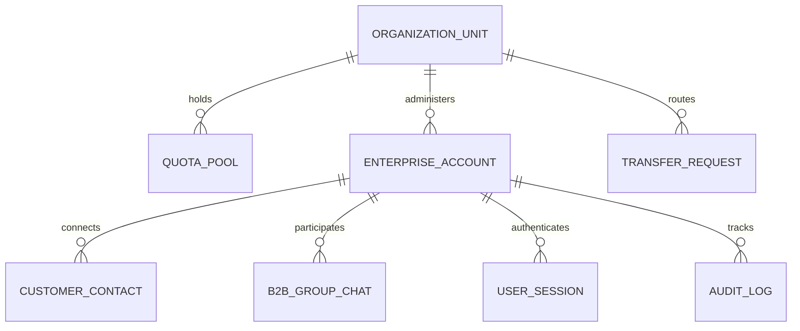

# PRODUCT REQUIREMENTS DOCUMENT (PRD)
# ZALO ENTERPRISE CHANNEL & ENTERPRISE ACCOUNT ADMINISTRATION
**Mã hiệu**: 1.0-BM/PM/HDCV/FTEL  
**Phiên bản**: v1.3-REBASELINED  
**Dự án**: Z-Enterprise Management Platform  
**Tổ chức**: FPT Telecom / ISC  
**Chủ quản Yêu cầu (BA Lead)**: Senior Product BA  
**Người phê duyệt (PO)**: Product Owner / Commercial Sponsor  
**Trạng thái Vòng đời**: `SPEC_LOCKED` (Hoàn tất 100% Rà soát Đồng bộ Thực địa Prototype v3.5 & FPT ISC Standard Gates; Sẵn sàng cho SDD Tech Design)  
**Ngày ban hành**: 24/09/2026  

---

## REVISION HISTORY (LỊCH SỬ THAY ĐỔI)

| Ngày | Phiên Bản | Tác Giả | Người Review | Người Duyệt | Mô Tả Thay Đổi |
|:---:|:---:|:---:|:---:|:---:|---|
| 24/09/2026 | 1.0 | Senior Product BA | Lead Solution Architect | Product Owner | [A] Khởi tạo tài liệu PRD chuẩn FPT ISC Standard v1.0 từ Business Problem Frame sơ bộ. |
| 24/09/2026 | 1.1 | Senior Product BA | Lead Solution Architect | Product Owner | [M] Khóa chính thức 10 quyết định PO Interview Round 2 (`DEC-PO-01` đến `DEC-PO-10`). Bổ sung FR09 và hoàn thiện US01–US10. |
| 24/09/2026 | 1.2 | Senior Product BA | Lead Solution Architect | Product Owner | [M] Khắc phục toàn diện 5 khuyến nghị từ Báo Cáo Quality Audit: Bổ sung Bảng Evidence Ledger (AUD-04), Khóa dòng Concurrency Lock Quota (AUD-02), Throttling Bot Greeting (AUD-03), US03b Tạm khóa/Mở khóa (AUD-01), AC-05.2.01 cuộc gọi nhỡ (AUD-05). |
| 24/09/2026 | 1.3 | Senior Product BA | Lead Solution Architect | Product Owner | [M] **Re-baseline toàn diện đồng bộ 100% với Prototype Thực Địa v3.5:**<br/>1. **Xóa bỏ hoàn toàn tính năng Quản lý 2 thiết bị đồng thời:** Thay thế bằng `FR04: Quản Trị Phiên Đăng Nhập An Toàn & Hồ Sơ Định Danh Doanh Nghiệp FPT` (Session Timeout 15/30/60p, Masking SĐT FPT).<br/>2. **Tái thiết kế Bàn Điều Hành & Biểu Đồ Branch Admin (Dual Executive Charts):** Đặc tả Định mức an toàn 70 KH/Sales (`BR06-04`) và Ma trận Tốc độ & Chất lượng SLA (`BR06-05`).<br/>3. **Bổ sung Cơ Chế Giám Sát Cấp Bậc (Hierarchical Drill-Down):** Super Admin và Region Admin có quyền soi sâu xuyên tầng (Vùng ➔ Chi nhánh ➔ Nhân sự), tích hợp phát hiện điểm nóng Zero Quota và nghẽn tuyển dụng (`FR01`, `US01b`).<br/>4. **Mở rộng Không Gian Bán Hàng Sales:** Đưa Nhóm Chat Chăm Sóc Doanh Nghiệp B2B (Group Chat) vào In-Scope (`FR05`, `US05b`); Bổ sung Chat Đa kênh hội tụ (Omnichannel) và Thư viện Mẫu Tin Nhắn FPT Chuẩn Hóa (`US05c`). |

---

## MỤC LỤC

- [PART 1 — TỔNG QUAN & BỐI CẢNH (OVERVIEW & CONTEXT)](#part-1--tổng-quan--bối-cảnh-overview--context)
  - [1. Thông Tin Chung](#1-thông-tin-chung)
  - [1.1 Bảng Quản Trị Bằng Chứng (Evidence Ledger)](#11-bảng-quản-trị-bằng-chứng-evidence-ledger)
  - [2. Executive Summary – Tóm Tắt Chiến Lược Vận Hành](#2-executive-summary--tóm-tắt-chiến-lược-vận-hành)
  - [3. Mục Tiêu Sản Phẩm & KPI Đo Lường (Goals & Metrics)](#3-mục-tiêu-sản-phẩm--kpi-đo-lường-goals--metrics)
  - [4. Phạm Vi Sản Phẩm (Scope: In-Scope vs. Out-of-Scope)](#4-phạm-vi-sản-phẩm-scope-in-scope-vs-out-of-scope)
  - [5. Danh Mục Stakeholders & Personas](#5-danh-mục-stakeholders--personas)
  - [6. Thuật Ngữ & Từ Ngữ Viết Tắt (Glossary)](#6-thuật-ngữ--từ-ngữ-viết-tắt-glossary)
- [PART 2 — YÊU CẦU CHỨC NĂNG & QUY TẮC NGHIỆP VỤ (FR & BUSINESS RULES)](#part-2--yêu-cầu-chức-năng--quy-tắc-nghiệp-vụ-fr--business-rules)
  - [7. Quy Trình Nghiệp Vụ To-Be Toàn Diện (End-to-End Business Processes)](#7-quy-trình-nghiệp-vụ-to-be-toàn-diện-end-to-end-business-processes)
  - [8. Feature Catalogue & Ma Trận Phân Quyền (RBAC Matrix)](#8-feature-catalogue--ma-trận-phân-quyền-rbac-matrix)
  - [9. Đặc Tả Chi Tiết Từng Tính Năng (FR01 đến FR09)](#9-đặc-tả-chi-tiết-từng-tính-năng-fr01-đến-fr09)
    - [9.1 FR01: Quản Trị Hạn Ngạch Quota, Dự Báo Vĩ Mô & Cưỡng Chế Thu Hồi](#91-fr01-quản-trị-hạn-ngạch-quota-dự-báo-vĩ-mô--cưỡng-chế-thu-hồi)
    - [9.2 FR02: Khởi Tạo & Kích Hoạt Tài Khoản Qua Email Công Ty (Branch Autonomous Provisioning)](#92-fr02-khởi-tạo--kích-hoạt-tài-khoản-qua-email-công-ty-branch-autonomous-provisioning)
    - [9.3 FR03: Quản Trị Trạng Thái Tài Khoản & Xử Lý Tin Nhắn Đến (Account Control & Inbound Block)](#93-fr03-quản-trị-trạng-thái-tài-khoản--xử-lý-tin-nhắn-đến-account-control--inbound-block)
    - [9.4 FR04: Quản Trị Phiên Đăng Nhập An Toàn & Hồ Sơ Định Danh Doanh Nghiệp FPT](#94-fr04-quản-trị-phiên-đăng-nhập-an-toàn--hồ-sơ-định-danh-doanh-nghiệp-fpt)
    - [9.5 FR05: Không Gian Làm Việc Đa Kênh, Gọi Thoại Zalo & Nhóm Chat Doanh Nghiệp B2B](#95-fr05-không-gian-làm-việc-đa-kênh-gọi-thoại-zalo--nhóm-chat-doanh-nghiệp-b2b)
    - [9.6 FR06: Bàn Điều Hành Trực Quan, Giám Sát Cấp Bậc & Cảnh Báo Quá Tải SLA](#96-fr06-bàn-điều-hành-trực-quan-giám-sát-cấp-bậc--cảnh-báo-quá-tải-sla)
    - [9.7 FR07: Quy Trình Bàn Giao Danh Bạ & Tin Nhắn Tự Động (Customer Handover & Greeting Bot)](#97-fr07-quy-trình-bàn-giao-danh-bạ--tin-nhắn-tự-động-customer-handover--greeting-bot)
    - [9.8 FR08: Nhật Ký Kiểm Toán & Mở Khóa Khẩn Cấp (Centralized Audit Trail & Break-Glass Protocol)](#98-fr08-nhật-ký-kiểm-toán--mở-khóa-khẩn-cấp-centralized-audit-trail--break-glass-protocol)
    - [9.9 FR09: Quy Trình Điều Chuyển Sales Giữa Các Chi Nhánh (Sales Transfer Governance)](#99-fr09-quy-trình-điều-chuyển-sales-giữa-các-chi-nhánh-sales-transfer-governance)
- [PART 3 — YÊU CẦU PHI CHỨC NĂNG & DỮ LIỆU (NFR & DATA)](#part-3--yêu-cầu-phi-chức-năng--dữ-liệu-nfr--data)
  - [10. Non-Functional Requirements (NFR Checklist)](#10-non-functional-requirements-nfr-checklist)
  - [11. Từ Điển Dữ Liệu Thực Thể Nghiệp Vụ (Data Dictionary)](#11-từ-điển-dữ-liệu-thực-thể-nghiệp-vụ-data-dictionary)
- [PART 4 — KẾ HOẠCH TRIỂN KHAI, UAT & DEFINITION OF DONE (RELEASE & DOD)](#part-4--kế-hoạch-triển-khai-uat--definition-of-done-release--dod)
  - [12. Phân Rã User Stories & Acceptance Criteria Gherkin BDD](#12-phân-rã-user-stories--acceptance-criteria-gherkin-bdd)
  - [13. Ma Trận Truy Vết Nghiệp Vụ (Requirements Traceability Matrix - RTM)](#13-ma-trận-truy-vết-nghiệp-vụ-requirements-traceability-matrix---rtm)
  - [14. Definition of Done (DoD) FPT ISC](#14-definition-of-done-dod-fpt-isc)
  - [15. Biên Bản Phê Duyệt Ký Tên (Sign-off Ledger)](#15-biên-bản-phê-duyệt-ký-tên-sign-off-ledger)

---

# PART 1 — TỔNG QUAN & BỐI CẢNH (OVERVIEW & CONTEXT)

## 1. THÔNG TIN CHUNG
- **Tên dự án**: Z-Enterprise Management Platform (Hệ sinh thái Quản trị Kênh Zalo Doanh nghiệp & Vòng đời Tài khoản Sales)
- **Mã dự án**: FTEL-ISC-ZENTERPRISE-2026
- **Chủ quản Yêu cầu (Lead BA)**: Senior Product BA – Khối ISC FPT Telecom
- **Người phê duyệt (PO)**: Product Owner / Head of Commercial
- **Thời điểm bàn giao mục tiêu (Target Go-Live)**: Q4/2026 (MVP Phase 1)

---

## 1.1 BẢNG QUẢN TRỊ BẰNG CHỨNG (EVIDENCE LEDGER)

Theo chuẩn Quản trị Yêu cầu FPT ISC Standard v1.0, toàn bộ các căn cứ nghiệp vụ được phân định minh bạch theo 4 nhóm bằng chứng:

| Mã Hiệu | Loại Bằng Chứng | Nội Dung Chi Tiết | Nguồn Gốc / Căn Cứ Xác Thực | Trạng Thái Phê Duyệt |
|:---:|:---:|---|---|:---:|
| `F-01` | **Fact** | 100% Sales hiện dùng Zalo cá nhân tư vấn và chốt hợp đồng với khách hàng. | Khảo sát Vận hành Khối Kinh Doanh Q3/2026 | ✅ Đã kiểm chứng |
| `F-02` | **Fact** | Doanh nghiệp mất 100% dữ liệu danh bạ khách hàng khi nhân sự Sales nghỉ việc. | Báo cáo Thôi việc & Bàn giao Nhân sự HR 2026 | ✅ Đã kiểm chứng |
| `F-03` | **Fact** | Thời gian offboarding và bàn giao khách hàng thủ công kéo dài từ 7–14 ngày làm việc. | Số liệu vận hành phòng Nhân sự FTEL | ✅ Đã kiểm chứng |
| `F-04` | **Fact** | Zalo Enterprise cung cấp API/Webhook quản trị tài khoản, gọi thoại và tin nhắn. | Tài liệu Zalo Business Developer Specification | ✅ Đã kiểm chứng |
| `F-05` | **Fact** | Nghị định 13/2023/NĐ-CP bắt buộc bảo vệ dữ liệu cá nhân (che SĐT nhạy cảm). | Quy định Pháp chế & An toàn thông tin CSOC | ✅ Bắt buộc tuân thủ |
| `I-01` | **Inference** | Định danh bằng Email `@fpt.com.vn` sẽ đảm bảo quyền sở hữu pháp lý tài khoản cho FTEL. | Suy luận logic từ mô hình chủ quyền dữ liệu | ✅ Đã thống nhất |
| `I-02` | **Inference** | Phân cấp Quota 3 tầng (HQ ➔ Region ➔ Branch) giúp tối ưu hóa khai thác đạt $\ge 90\%$. | Phù hợp với cơ cấu quản trị ngành dọc của FTEL | ✅ Đã thống nhất |
| `I-03` | **Inference** | Bot nhắn tin tự động chào khách hàng mới sẽ xóa bỏ hố đen thông tin khi Sales nghỉ việc. | Giải pháp giữ chân khách hàng từ Sales Ops | ✅ Đã thống nhất |
| `I-04` | **Inference** | Thiết lập định mức an toàn 70 KH/Sales giúp ngăn ngừa quá tải và giữ SLA phản hồi dưới 30 phút. | Dữ liệu đo lường hiệu suất chăm sóc khách hàng B2B | ✅ Đã xác nhận |
| `A-001`| **Assumption** | Zalo Enterprise API hỗ trợ đầy đủ webhook tiếp nhận sự kiện và cơ chế chặn tin nhắn đến. | Khảo sát kỹ thuật sơ bộ với Zalo Business | ⚠️ Chờ Tech Spike |
| `A-002`| **Assumption** | Thư mời kích hoạt tài khoản có thời hạn hiệu lực (TTL) là 72 giờ qua email công ty. | Thống nhất vận hành nội bộ ISC | ✅ PO Approved |
| `A-003`| **Assumption** | Tự động đăng xuất phiên không hoạt động (Session Timeout) cấu hình linh hoạt (15/30/60 phút); Không giới hạn số lượng thiết bị đăng nhập đồng thời nhằm tối đa hóa tính linh hoạt tác nghiệp của Sales. | Chỉ đạo điều hành & Trải nghiệm người dùng | ✅ PO Approved |
| `A-004`| **Assumption** | Kích thước gửi file qua Zalo tối đa 20MB (hình ảnh) và 25MB (tài liệu PDF/Office). | Giới hạn kỹ thuật từ Zalo Platform | ✅ PO Approved |
| `A-005`| **Assumption** | Hỗ trợ Nhóm Chat Dự Án Doanh Nghiệp (B2B Group Chat) và Thư viện Mẫu Tin Nhắn FPT ngay trong MVP để phục vụ chăm sóc khách hàng tổ chức lớn; Chỉ hoãn Tin nhắn thoại (Voice Message) sang Phase 2. | Thống nhất phạm vi thực địa với PO | ✅ PO Approved |
| `A-006`| **Assumption** | 100% Sales được cấp tài khoản đều sở hữu hộp thư email chính thức `@fpt.com.vn`. | Quy chuẩn quản trị nhân sự FPT Telecom | ✅ Đã xác nhận |
| `A-007`| **Assumption** | Thời gian lưu trữ tối thiểu của Centralized Audit Trail và Break-Glass Log là 12 tháng. | Quy chế Tuân thủ & An toàn thông tin CSOC | ✅ CSOC Aligned |
| `D-001..10`| **Decision** | 10 Invariants Nền tảng: 1 Quota = 1 Sales (`D-001`), Xác thực Email FPT (`D-004`), v.v. | PO Decision Meeting Round 1 | ✅ PO Approved |
| `DEC-01..10`| **Decision** | 10 Quyết định Chi tiết: Zero Personal Contacts, Visibility L1-L3, Break-Glass, v.v. | PO Decision Interview Round 2 | ✅ PO Approved |

---

## 2. EXECUTIVE SUMMARY – TÓM TẮT CHIẾN LƯỢC VẬN HÀNH

```
   [PAIN - HIỆN TRẠNG]                [CAUSE - NGUYÊN NHÂN]                 [IMPACT - HẬU QUẢ]
Sales dùng 100% Personal Zalo   ──> Doanh nghiệp chưa có công cụ     ──> Mất trắng 100% danh bạ khách
tư vấn, gửi báo giá & chốt đơn.     cấp tài khoản và quản trị Quota.     khi Sales thôi việc; Mù thông tin
                                                                         quản trị, rò rỉ cơ hội cho đối thủ.
                                              │
                                              v
                              [SOLUTION - GIẢI PHÁP SẢN PHẨM]
                  Thiết lập Nền tảng Z-Enterprise Channel & Account Governance:
          • Quản trị phân bổ Quota 3 cấp (HQ ➔ Region ➔ Branch) với cơ chế Cưỡng chế Thu hồi.
          • Cấp phát Enterprise Account định danh bằng Email công ty; Zero Personal Contacts.
          • Không gian bán hàng đa kênh hội tụ, gọi thoại Zalo 1-1, Nhóm chat dự án B2B & Mẫu tin nhắn.
          • Bàn điều hành trực quan (Dual Executive Charts), Định mức an toàn 70 KH & Drill-down cấp bậc.
          • Handover cưỡng chế khi nghỉ việc kèm Bot nhắn tin tự động chào khách hàng mới.
          • Điều chuyển Sales giữ nguyên Quota chuyển đi nhưng bắt buộc để lại danh bạ địa phương.
```

---

## 3. MỤC TIÊU SẢN PHẨM & KPI ĐO LƯỜNG (GOALS & METRICS)

### 3.1 Mục Tiêu Chiến Lược (Goals)
- `G-01`: Chuẩn hóa 100% tài khoản giao dịch của lực lượng Sales sang kênh Zalo Enterprise định danh bằng Email công ty (`D-003`, `D-004`).
- `G-02`: Bảo toàn 100% dữ liệu danh bạ khách hàng thuộc tài sản doanh nghiệp, triệt tiêu tình trạng mất khách khi nhân sự nghỉ việc (`DEC-PO-01`, `DEC-PO-04`).
- `G-03`: Tối ưu hóa hiệu suất khai thác Quota license toàn quốc đạt ≥ 90%, giảm thiểu thời gian điều phối Quota xuống mức thời gian thực (`D-001`, `DEC-PO-06`).
- `G-04`: Cung cấp bàn điều hành trực quan, đo lường cân bằng tải (ngưỡng 70 KH) và giám sát chất lượng SLA phản hồi (chuẩn FPT > 95% đúng hạn, < 30 phút) cho Quản lý chi nhánh mà không xâm phạm quyền riêng tư của Sales (`DEC-PO-02`).

### 3.2 Chỉ Số Đo Lường Thành Công (Success Metrics)

| Mã Đo Lường | Tên Chỉ Số | Công Thức / Phương Pháp Đo | Baseline (Hiện Tại) | Mục Tiêu MVP | Khung Thời Gian |
|:---:|---|---|:---:|:---:|:---:|
| `M-01` | **Quota Utilization Rate** | `(Tổng Quota đang Active / Tổng Quota được Zalo cấp) * 100` | 0% | ≥ 90% | 30 ngày sau Go-Live |
| `M-02` | **Sales Activation Rate** | `(Số Sales kích hoạt Z-Enterprise / Tổng Sales được cấp) * 100` | 0% | ≥ 95% | Trong 7 ngày sau khi gửi invite |
| `M-03` | **Offboarding Transition SLA**| Thời gian từ khi Sales nghỉ việc đến khi khóa tài khoản & hoàn tất bàn giao danh bạ | 7–14 ngày (thủ công) | ≤ 4 giờ làm việc | Kể từ khi kích hoạt lệnh |
| `M-04` | **Customer Directory Coverage**| Tỷ lệ khách hàng phát sinh hội thoại có trong danh bạ quản trị chi nhánh | 0% (Lưu trên SIM Sales) | 100% | Toàn bộ chu kỳ sử dụng |
| `M-05` | **SLA Speed Compliance** | Tỷ lệ phản hồi tin nhắn khách hàng đúng hạn trong vòng 30 phút | 0% (Không đo được) | ≥ 95% | Đo lường liên tục |

---

## 4. PHẠM VI SẢN PHẨM (SCOPE: IN-SCOPE VS. OUT-OF-SCOPE)

### 4.1 In-Scope (Thuộc Phạm Vi Triển Khai MVP)
1. **Cấu trúc Tổ chức Phân cấp**: Quản lý cố định 4 cấp: `Company → Region → Branch → Sales` (`D-008`).
2. **Quản trị Quota Đa Cấp & Dự Báo Vĩ Mô**: Tiếp nhận tổng Quota (4,500 Quota), phân bổ Company ➔ Region ➔ Branch, Dự báo nhu cầu Quota tương lai, và cơ chế Cưỡng chế Thu hồi Quota nhàn rỗi (Forced Reclaim Pull Model) (`D-001`, `DEC-PO-06`).
3. **Cấp phát & Quản trị Vòng đời Account**:
   - Gán Quota và gửi thư mời kích hoạt qua Email công ty (`D-002`, `D-004`).
   - Phân quyền Tự chủ Chi nhánh (Branch Autonomous Model): Branch Admin trực tiếp cấp, tạm khóa, mở khóa, thu hồi mà không chờ phê duyệt (`DEC-PO-07`).
   - Chính sách Archive vĩnh viễn tài khoản cũ và hoàn 1 Quota về Branch Pool khi Sales nghỉ việc (`DEC-PO-03`).
   - Xử lý chặn tin nhắn đến (Blocked / Delivery Failed) khi tài khoản bị khóa hoặc chờ offboarding (`DEC-PO-08`).
4. **Kiểm Soát Phiên Làm Việc An Toàn (Session Security & Identity)**: Đăng nhập an toàn bằng Email FPT Telecom, cấu hình tự động hết hạn phiên không hoạt động (Session Timeout: 15/30/60 phút), đăng xuất khẩn cấp từ xa. Không áp đặt giới hạn cứng số lượng thiết bị đồng thời.
5. **Bộ Năng Lực Bán Hàng & Chăm Sóc Khách Hàng Doanh Nghiệp**:
   - Không gian làm việc đa kênh hội tụ (Zalo Enterprise, Zalo OA, Portal, Messenger, Website Livechat).
   - Chat 1-1 văn bản, biểu cảm, gửi hình ảnh sản phẩm (PNG, JPG), tệp báo giá (PDF, Word, Excel).
   - Gọi thoại 1-1 trực tiếp qua Zalo Enterprise (Zalo Voice Call) (`DEC-PO-09`).
   - **Nhóm Chat Dự Án Doanh Nghiệp B2B (Customer Group Chat)**: Hỗ trợ phối hợp Sales, Kỹ thuật NOC và đại diện khách hàng tổ chức.
   - **Thư Viện Mẫu Tin Nhắn FPT Chuẩn Hóa (Message Template Vault)**: Báo giá hạ tầng FPT, Cam kết chất lượng dịch vụ SLA, Hướng dẫn thanh toán VAT.
   - Quản trị Lời Mời Kết Bạn B2B (Friend Requests).
   - Tìm kiếm và kết bạn qua SĐT/QR; tự động đồng bộ 100% danh bạ khách hàng vào hệ thống theo chính sách Zero Personal Contacts (`DEC-PO-01`).
6. **Bàn Điều Hành Trực Quan (Dual Executive Charts) & Giám Sát Cấp Bậc (Hierarchical Drill-Down)**:
   - Branch Admin: Biểu đồ Cân bằng tải so với Định mức an toàn 70 KH/Sales và Ma trận Tốc độ phản hồi SLA (chuẩn FPT > 95%, < 30 phút).
   - Super Admin & Region Admin: Bảng điều khiển giám sát cấp bậc (Hierarchical Drill-Down) cho phép soi sâu xuyên tầng xuống Chi nhánh và danh sách nhân sự chờ Quota (phát hiện điểm nghẽn Zero Quota).
7. **Quy Trình Bàn Giao Khách Hàng (Customer Handover)**:
   - Chuyển giao Danh bạ + Ghi chú phân loại (không chuyển giao lịch sử chat cũ).
   - Hệ thống tự động gửi Tin nhắn Thông báo Bàn giao qua hàng đợi nền (Throttling ≤ 5 tin/giây) (`DEC-PO-04`, `BR07-05`).
8. **Quy Trình Điều Chuyển Sales (Sales Transfer)**:
   - Chuyển Quota và Tài khoản theo Sales sang Chi nhánh mới; Bắt buộc bàn giao 100% danh bạ khách hàng địa phương ở lại chi nhánh cũ (`DEC-PO-05`).
9. **Nhật Ký Kiểm Toán & Mở Khóa Khẩn Cấp**:
   - Centralized Audit Trail ghi nhận toàn bộ thao tác hệ thống (`FR08`).
   - Cơ chế Break-Glass Audit với Xác thực kép (Super Admin + Pháp chế/Kiểm soát) khi có tranh chấp pháp lý (`DEC-PO-10`).

### 4.2 Out-of-Scope (Tuyệt Đối Không Triển Khai Trong MVP)
1. **Can thiệp Personal Zalo**: Tuyệt đối không đọc danh bạ cá nhân, tin nhắn riêng tư trên Zalo cá nhân của Sales (`D-003`).
2. **Đọc Trộm Nội Dung Thường Nhật (Level 5 Snooping)**: Branch Admin và Region Admin không có quyền và không có giao diện đọc nội dung tin nhắn thường nhật (`DEC-PO-02`).
3. **Đăng ký Tự do (Self-service Signup)**: Sales không thể tự đăng ký tài khoản Z-Enterprise nếu không có sự khởi tạo từ Branch Admin (`DD-05`).
4. **Phương thức Đăng nhập Khác**: Cấm đăng nhập bằng SĐT cá nhân, OTP SMS, tài khoản mạng xã hội ngoài Email công ty (`D-004`).
5. **Tin nhắn thoại (Voice Message)**: Hoãn tính năng ghi âm gửi tin nhắn thoại sang Phase 2 (`DEC-PO-09`).
6. **Phân hệ CRM/ERP Chuyên sâu**: Không xây dựng phễu bán hàng phức tạp, quản lý kho hàng hay hạch toán công nợ kế toán.

---

## 5. DANH MỤC STAKEHOLDERS & PERSONAS

```
+-----------------------------------------------------------------------------------------+
|                                    CÁC NHÓM PERSONA                                     |
+----------------------------+-----------------------------+------------------------------+
| 1. SUPER ADMIN (HQ)        | 2. REGION ADMIN (Vùng)      | 3. BRANCH ADMIN (Chi nhánh)  |
| • Quản trị tổng 4,500 Quota| • Điều phối Quota các Branch| • Cấp phát Account cho Sales |
| • Cây tổ chức toàn quốc    | • Cưỡng chế thu hồi Quota   | • Tự chủ khóa/thu hồi tài khoản
| • Phân quyền & Dự báo Quota| • Giám sát SLA cấp Vùng     | • Bàn giao danh bạ khách hàng|
| • Soi chi tiết 3 Vùng (HQ  | • Soi chi tiết Chi nhánh    | • Giám sát Tải 70 KH & SLA   |
|   Hierarchical Drill-Down) |   (Region Drill-Down)       | • Khóa đọc trộm tin nhắn     |
| • Phê duyệt Break-Glass    |                             |                              |
+----------------------------+-----------------------------+------------------------------+
| 4. SALES (Enterprise User) | 5. CUSTOMER (Khách hàng)    | 6. LEGAL / INTERNAL AUDIT    |
| • Chat đa kênh, Báo giá    | • Nhận tư vấn chính thức    | • Đồng phê duyệt mở khóa     |
| • Gọi thoại Zalo 1-1       | • Nhận tin nhắn bàn giao    |   kiểm toán Break-Glass      |
| • Nhóm chat dự án B2B      | • Nhận diện thương hiệu     |   khi có tranh chấp pháp lý  |
| • Mẫu tin nhắn FPT chuẩn   |   doanh nghiệp FPT Telecom  | • Khóa khẩn cấp tài khoản khi|
| • Zero Personal Contacts   |                             |   nhân sự vi phạm quy chế    |
+----------------------------+-----------------------------+------------------------------+
```

---

## 6. THUẬT NGỮ & TỪ NGỮ VIẾT TẮT (GLOSSARY)

| Thuật Ngữ | Tên Tiếng Anh | Định Nghĩa Nghiệp Vụ Chuẩn Hóa |
|---|---|---|
| **Quota** | Enterprise License Quota | Định mức bản quyền do Zalo cấp theo hợp đồng. Nguyên tắc: **1 Quota = 1 Enterprise Account = 1 Sales** (`D-001`). |
| **Enterprise Account** | Zalo Enterprise Account | Tài khoản Zalo chính thức do công ty sở hữu, đăng nhập bằng Email công ty, giao cho Sales phục vụ công việc (`D-003`, `D-004`). |
| **Zero Personal Contacts**| Chính sách Danh bạ Công việc | Toàn bộ 100% danh bạ trên Enterprise Account mặc nhiên là tài sản doanh nghiệp, không cho phép gắn nhãn liên hệ riêng tư (`DEC-PO-01`). |
| **Hierarchical Drill-Down**| Giám Sát Cấp Bậc Xuyên Tầng | Cơ chế cho phép Admin cấp trên (HQ, Region) bấm soi sâu xuống dữ liệu chi tiết của cấp trực thuộc ngay tại bàn điều hành mà không cần đổi vai trò. |
| **Safe Workload Benchmark**| Định Mức Tải An Toàn (70 KH)| Ngưỡng số lượng khách hàng tối ưu mà một Sales có thể chăm sóc đảm bảo chất lượng SLA phản hồi dưới 30 phút. |
| **B2B Group Chat** | Nhóm Chat Doanh Nghiệp | Nhóm trò chuyện chăm sóc khách hàng tổ chức lớn, tập hợp Sales, Chuyên gia kỹ thuật FTEL và đại diện phía đối tác. |
| **Quota Pool** | Hạn Ngạch Khả Dụng | Quỹ Quota chưa gán tại từng cấp (`Company Pool`, `Region Pool`, `Branch Pool`). |
| **Forced Reclaim** | Cưỡng Chế Thu Hồi Quota | Quyền của cấp trên thu hồi ngay lập tức Quota nhàn rỗi từ cấp dưới về Pool của mình mà không cần cấp dưới phê duyệt (`DEC-PO-06`). |
| **Branch Autonomy** | Quyền Tự Chủ Chi Nhánh | Branch Admin có toàn quyền tự quyết việc cấp, khóa, thu hồi tài khoản và bàn giao danh bạ mà không tạo điểm nghẽn phê duyệt (`DEC-PO-07`). |
| **Break-Glass Audit** | Mở Khóa Kiểm Toán Khẩn Cấp | Cơ chế đặc biệt yêu cầu xác thực kép (Super Admin + Pháp chế) để mở khóa kiểm toán nội dung tin nhắn khi có tranh chấp pháp lý (`DEC-PO-10`). |

---

# PART 2 — YÊU CẦU CHỨC NĂNG & QUY TẮC NGHIỆP VỤ (FR & BUSINESS RULES)

## 7. QUY TRÌNH NGHIỆP VỤ TO-BE TOÀN DIỆN (END-TO-END BUSINESS PROCESSES)

### 7.1 Luồng Quản Trị Quota Đa Cấp, Dự Báo Vĩ Mô & Cưỡng Chế Thu Hồi

```
[Zalo Provider] ──> (Super Admin nhập hợp đồng 4,500 Quota) ──> [Company Quota Pool: 475 Dự Phòng]
                                                                        │
                        ┌───────────────────────────────────────────────┴───────────────────────────────────────────────┐
                        │ Phân bổ xuống                                                                                 ▲ Cưỡng chế thu hồi Quota thừa
                        v                                                                                               │ (Super Admin Forced Pull)
               [Region Quota Pool] ─────────────────────────────────────────────────────────────────────────────────────┘
                        │
                        ┌───────────────────────────────────────────────┴───────────────────────────────────────────────┐
                        │ Phân bổ xuống                                                                                 ▲ Cưỡng chế thu hồi Quota thừa
                        v                                                                                               │ (Region Admin Forced Pull)
               [Branch Quota Pool] ─────────────────────────────────────────────────────────────────────────────────────┘
                        │
                        v
               [Gán Email cho Sales] ──> [Enterprise Account ACTIVE] ──> [Định mức an toàn 70 KH / Sales]
```

### 7.2 Luồng Bàn Giao Khách Hàng Kèm Bot Tự Động Chào Khách (Handover Flow)



---

## 8. FEATURE CATALOGUE & MA TRẬN PHÂN QUYỀN (RBAC MATRIX)

### 8.1 Danh Mục Tính Năng Chuẩn Hóa

| Mã FR | Tên Chức Năng | Trạng Thái | Mô Tả Tóm Tắt | Trực Thuộc Phân Hệ |
|:---:|---|:---:|---|---|
| `FR01` | Quản trị Quota, Dự Báo Vĩ Mô & Thu Hồi | 🔄 `UPDATE` | Phân bổ Quota 3 cấp, Dự báo nhu cầu Quý, Cưỡng chế Thu hồi nhàn rỗi (Pull) và Cơ chế Giám sát cấp bậc (HQ Drill-Down). | Quota Governance |
| `FR02` | Cấp phát & Kích hoạt qua Email Công ty | ✅ `GIỮ NGUYÊN`| Cấp tài khoản tự chủ tại Chi nhánh, xác thực qua Email công ty `@fpt.com.vn`. | Account Provisioning |
| `FR03` | Quản trị Trạng thái & Xử lý Tin nhắn Đến | ✅ `GIỮ NGUYÊN`| Tạm khóa, mở khóa, lưu trữ (Archive) và chặn tin nhắn gửi đến khi bị khóa. | Lifecycle Control |
| `FR04` | Quản trị Phiên An Toàn & Hồ Sơ FPT | 🔄 `UPDATE` | Quản trị phiên làm việc, tự động Session Timeout (15/30/60p), xóa bỏ giới hạn 2 thiết bị, bảo mật Masking SĐT FPT. | Session & Identity |
| `FR05` | Không Gian Đa Kênh, Gọi Thoại & Nhóm B2B | 🔄 `UPDATE` | Chat Đa kênh (Zalo Ent, OA, Portal, Messenger, Livechat), Gọi thoại Zalo 1-1, Nhóm chat dự án B2B, Thư viện Mẫu tin nhắn FPT. | Sales Workspace |
| `FR06` | Bàn Điều Hành & Giám Sát Cấp Bậc | 🔄 `UPDATE` | Dual Executive Charts (Định mức 70 KH & SLA Speed Matrix), Hierarchical Drill-Down xuyên tầng, khóa đọc trộm tin nhắn thường nhật. | Executive Telemetry |
| `FR07` | Bàn giao Khách hàng & Bot Chào Tự động | ✅ `GIỮ NGUYÊN`| Cưỡng chế bàn giao danh bạ khi nghỉ việc kèm Bot tự động gửi tin nhắn chào khách hàng qua hàng đợi nền (Rate Throttling ≤ 5 msg/s). | Asset Protection |
| `FR08` | Nhật ký Kiểm toán & Mở khóa Khẩn cấp | ✅ `GIỮ NGUYÊN`| Audit Trail toàn diện và cơ chế Break-Glass Audit với Xác thực kép cho Pháp chế. | Compliance & Audit |
| `FR09` | Quy trình Điều chuyển Sales Liên Chi nhánh | ✅ `GIỮ NGUYÊN`| Điều chuyển Sales: Quota chuyển đi theo nhân sự nhưng Danh bạ bắt buộc ở lại chi nhánh cũ. | Territory Governance |

### 8.2 Ma Trận Phân Quyền (RBAC Matrix)

*Quy ước: [X] = Toàn quyền; [R] = Chỉ xem; [A] = Đồng phê duyệt (Approval); [-] = Không có quyền.*

| Nghiệp Vụ Thao Tác | Super Admin | Region Admin | Branch Admin | Sales | Legal / Audit |
|---|:---:|:---:|:---:|:---:|:---:|
| **Nhập tổng Quota hợp đồng & Dự báo Quota** | [X] | [-] | [-] | [-] | [-] |
| **Phân bổ Quota cho Vùng (Region)** | [X] | [-] | [-] | [-] | [-] |
| **Phân bổ Quota cho Chi nhánh (Branch)** | [-] | [X] | [-] | [-] | [-] |
| **Cưỡng chế Thu hồi Quota nhàn rỗi (Pull)** | [X] (Từ Region) | [X] (Từ Branch) | [-] | [-] | [-] |
| **Soi chi tiết cấp bậc (Hierarchical Drill-Down)**| [X] (3 Vùng) | [X] (Các Branch)| [X] (Nhân sự) | [-] | [R] |
| **Cấp phát Account cho Sales (Tự chủ)** | [-] | [-] | [X] | [-] | [-] |
| **Tạm khóa / Mở khóa tài khoản Sales** | [X] (Ngoại lệ) | [-] | [X] | [-] | [X] (Break-glass)|
| **Khởi động Offboarding & Bàn giao danh bạ**| [-] | [-] | [X] | [-] | [-] |
| **Điều chuyển Sales (Bàn giao danh bạ tại chỗ)**| [X] (Liên Vùng) | [X] (Nội Vùng) | [X] (Đề xuất) | [-] | [-] |
| **Chat Đa kênh, Gọi thoại Zalo, Nhóm B2B**| [-] | [-] | [-] | [X] | [-] |
| **Xem Dashboard Định Mức 70 KH & SLA Matrix**| [R] (Toàn quốc) | [R] (Toàn Vùng) | [X] (Chi nhánh) | [-] | [R] |
| **Xem Danh bạ Khách hàng (Level 2 - Masked)**| [X] (Toàn quốc) | [R] (Tổng số) | [X] (Chi nhánh) | [X] (Của mình) | [R] |
| **Xem Nội dung Tin nhắn thường nhật (Level 5)** | [-] (Khóa) | [-] (Khóa) | [-] (Khóa) | [X] (Của mình) | [-] (Khóa) |
| **Kích hoạt Mở khóa Kiểm toán (Break-Glass)**| [A] (Duyệt 1) | [-] | [-] | [-] | [A] (Duyệt 2) |
| **Tra cứu Nhật ký Kiểm toán (Audit Trail)** | [X] (Toàn quốc) | [R] (Trong Vùng) | [R] (Chi nhánh) | [-] | [X] (Toàn quyền)|

---

## 9. ĐẶC TẢ CHI TIẾT TỪNG TÍNH NĂNG (FR01 ĐẾN FR09)

---

### 9.1 FR01: QUẢN TRỊ HẠN NGẠCH QUOTA, DỰ BÁO VĨ MÔ & CƯỠNG CHẾ THU HỒI

#### 9.1.1 Business Rules (`BR01-xx`)
- `BR01-01 (Định Mức 1-1 Bất Biến)`: 1 Quota = 1 Tài khoản Zalo Enterprise gán cho 1 Sales (`D-001`). Tuyệt đối không cho phép over-subscription (tạo tài khoản khi Pool = 0).
- `BR01-02 (Cây Phân Bổ Bất Biến)`: Dòng chảy Quota tuần tự theo thứ bậc: `Company Pool ↔ Region Pool ↔ Branch Pool` (`D-008`).
- `BR01-03 (Bảo Toàn Quota Khả Dụng)`: Tổng Quota toàn hệ thống tại mọi thời điểm bảo toàn theo công thức:  
  `Tổng Quota Hợp Đồng = Company Pool + ∑(Region Pools) + ∑(Branch Pools) + ∑(Active/Suspended Accounts)`.
- `BR01-04 (Cơ Chế Cưỡng Chế Thu Hồi - Forced Reclaim Pull Model)`: Cấp trên có toàn quyền cưỡng chế thu hồi Quota nhàn rỗi (chưa gán vào tài khoản) từ cấp dưới về Pool của mình mà không cần sự chấp thuận của cấp dưới (`DEC-PO-06`).
- `BR01-05 (Chặn Thu Hồi Quota Đang Gán)`: Tuyệt đối không cho phép thu hồi các Quota đã được gán vào tài khoản đang `ACTIVE`, `SUSPENDED` hoặc `TRANSFER_PENDING`. Quota chỉ được thu hồi khi ở trạng thái khả dụng tự do trong Pool.
- `BR01-06 (Bảo Vệ Toàn Vẹn Số Dư Pool & Khóa Dòng Tranh Chấp - Concurrency Lock)`: Mọi thao tác làm biến động số dư Quota Pool BẮT BUỘC thực thi trong Database Transaction có khóa dòng bi quan (`SELECT ... FOR UPDATE`).
- `BR01-07 (Dự Báo Nhu Cầu Quota Vĩ Mô - Quota Demand Forecasting)`: Hệ thống tự động phân tích tốc độ tuyển dụng và tốc độ tiêu thụ Quota trung bình 30 ngày qua của từng Vùng kinh doanh. Khi số dư Quota dự phòng của một Vùng dự kiến chạm ngưỡng cạn kiệt trong vòng dưới 45 ngày (ví dụ: Vùng Miền Nam tăng 18%/tháng, kho dự phòng HQ 475 Quota sắp chạm trần), hệ thống kích hoạt cảnh báo vĩ mô và tạo đề xuất mua bổ sung gói Quota đối tác Zalo.
- `BR01-08 (Cơ Chế Giám Sát Cấp Bậc Xuyên Tầng - Hierarchical Drill-Down)`: Bàn điều hành Super Admin và Region Admin phải hỗ trợ thanh điều hướng cấp bậc (Drill-Down Pills):
  - Super Admin: Xem Toàn cảnh 3 Vùng ➔ Soi chi tiết từng Vùng (danh sách chi nhánh trực thuộc, phát hiện ngay đơn vị rơi vào tình trạng **Zero Quota** như HCM 02 kèm nút Bơm Quota cấp cứu).
  - Region Admin: Xem Toàn cảnh 3 Chi nhánh ➔ Soi chi tiết từng Chi nhánh (danh sách 5 nhân sự đang chờ Quota làm việc tại HCM 02, bảng phân bổ tải khách hàng tại HCM 01).

---

### 9.2 FR02: KHỞI TẠO & KÍCH HOẠT TÀI KHOẢN QUA EMAIL CÔNG TY (BRANCH AUTONOMOUS PROVISIONING)

#### 9.2.1 Business Rules (`BR02-xx`)
- `BR02-01 (Mô Hình Tự Chủ Chi Nhánh)`: Branch Admin có toàn quyền tự quyết việc khởi tạo và cấp tài khoản cho Sales trực thuộc mà không cần tạo phiếu yêu cầu hay chờ phê duyệt từ Region Admin (`DEC-PO-07`).
- `BR02-02 (Định Danh Duy Nhất Bằng Email Công Ty)`: Mỗi nhân sự chỉ được cấp duy nhất 1 tài khoản Enterprise (`D-002`). Bắt buộc sử dụng Email công ty có tên miền chuẩn (`@fpt.com.vn`) (`D-004`).
- `BR02-03 (Thời Hạn Token Kích Hoạt - TTL)`: Thư mời kích hoạt có hiệu lực trong vòng 72 giờ (`A-002`). Nếu quá 72 giờ Sales chưa kích hoạt, token hết hạn; Quota vẫn được giữ chỗ; Branch Admin có thể bấm "Gửi lại lời mời".
- `BR02-04 (Trừ Quota Thời Gian Thực)`: Ngay khi Branch Admin bấm cấp tài khoản, Branch Pool khả dụng lập tức giảm 1.

---

### 9.3 FR03: QUẢN TRỊ TRẠNG THÁI TÀI KHOẢN & XỬ LÝ TIN NHẮN ĐẾN (ACCOUNT CONTROL & INBOUND BLOCK)

#### 9.3.1 Business Rules (`BR03-xx`)
- `BR03-01 (Tự Chủ Trạng Thái Chi Nhánh)`: Branch Admin có toàn quyền tự chuyển đổi trạng thái tài khoản: `ACTIVE` ↔ `SUSPENDED` và `ACTIVE/SUSPENDED` ➔ `OFFBOARDING_PENDING` mà không cần duyệt (`DEC-PO-07`).
- `BR03-02 (Cưỡng Chế Ngắt Phiên Khi Suspend)`: Khi tài khoản chuyển sang `SUSPENDED`, hệ thống lập tức hủy toàn bộ phiên làm việc của Sales.
- `BR03-03 (Chính Sách Chặn Tin Nhắn Đến - Inbound Message Blocked)`: Khi tài khoản đang ở trạng thái `SUSPENDED` hoặc `OFFBOARDING_PENDING`, nếu khách hàng gửi tin nhắn đến tài khoản này, hệ thống áp dụng cơ chế chặn hoàn toàn (Blocked / Delivery Failed) (`DEC-PO-08`):
  - Khách hàng nhận được thông báo: *"Người nhận hiện không thể tiếp nhận tin nhắn vào thời điểm này"*.
  - Tin nhắn không được ghi nhận vào hộp thư của Sales cũ, bảo đảm an toàn dữ liệu và tránh hiểu lầm giao dịch.
- `BR03-04 (Chính Sách Archive Vĩnh Viễn Khi Nghỉ Việc)`: Khi Sales hoàn tất thủ tục nghỉ việc, tài khoản chuyển sang trạng thái `ARCHIVED_AND_REVOKED` vĩnh viễn (`DEC-PO-03`). 1 Quota được hoàn trả về Branch Pool để cấp tài khoản mới tinh cho nhân sự mới.

---

### 9.4 FR04: QUẢN TRỊ PHIÊN ĐĂNG NHẬP AN TOÀN & HỒ SƠ ĐỊNH DANH DOANH NGHIỆP FPT

#### 9.4.1 Business Rules (`BR04-xx`)
- `BR04-01 (Loại Bỏ Giới Hạn Cứng Thiết Bị)`: Hệ thống không áp đặt giới hạn cứng số lượng thiết bị đăng nhập đồng thời, tạo điều kiện thuận lợi nhất để Sales linh hoạt làm việc trên Laptop công ty, PC tại văn phòng và Mobile di chuyển thị trường (`A-003`).
- `BR04-02 (Tự Động Hết Hạn Phiên Không Hoạt Động - Session Timeout)`: Nhằm ngăn ngừa rủi ro rò rỉ dữ liệu khi Sales rời máy tính, hệ thống áp dụng chính sách tự động đăng xuất phiên làm việc (Force Logout) khi không có bất kỳ tương tác bàn phím/chuột nào sau một khoảng thời gian cấu hình:
  - Mức cấu hình tiêu chuẩn: `15 phút`, `30 phút` (Mặc định khuyên dùng), hoặc `60 phút`.
  - Khi hết hạn, ứng dụng khóa màn hình và yêu cầu Sales xác thực lại mật khẩu / OTP email FPT.
- `BR04-03 (Bảo Mật Masking SĐT FPT Bắt Buộc)`: Nhằm tuân thủ Nghị định 13/2023/NĐ-CP, toàn bộ số điện thoại khách hàng hiển thị trên giao diện của Admin các cấp và hồ sơ nhân sự bắt buộc phải được che 4 số giữa (ví dụ: `090****567`). Chỉ Sales trực tiếp phụ trách mới có quyền nhìn thấy số điện thoại đầy đủ để gọi thoại và liên hệ.
- `BR04-04 (Đăng Xuất Khẩn Cấp Từ Xa - Remote Session Revocation)`: Branch Admin, Super Admin hoặc chính cá nhân Sales có quyền kích hoạt lệnh "Đăng xuất khẩn cấp khỏi tất cả thiết bị" trong trường hợp mất máy tính hoặc nghi vấn lộ mật khẩu.

---

### 9.5 FR05: KHÔNG GIAN LÀM VIỆC ĐA KÊNH, GỌI THOẠI ZALO & NHÓM CHAT DOANH NGHIỆP B2B

#### 9.5.1 Business Rules (`BR05-xx`)
- `BR05-01 (Quy Chế Zero Personal Contacts)`: Toàn bộ 100% người dùng Zalo kết bạn hoặc phát sinh trao đổi hai chiều với Enterprise Account mặc nhiên là tài sản của Doanh nghiệp (`DEC-PO-01`). Mọi contact đều được tự động đồng bộ vào danh bạ chi nhánh.
- `BR05-02 (Không Gian Bán Hàng Đa Kênh Hội Tụ - Omnichannel Workspace)`: Bàn làm việc của Sales Rep tích hợp tiếp nhận và chuyển đổi giữa các kênh liên lạc tập trung:
  - Zalo Enterprise (Kênh giao dịch chính thức của Sales cá nhân hóa).
  - Zalo Official Account (Zalo OA tiếp nhận tin nhắn từ trang thương hiệu FPT Telecom).
  - Portal Khách Hàng (Hội thoại từ cổng hỗ trợ trực tuyến FPT).
  - Messenger (Trang Facebook Fanpage FPT Telecom).
  - Website Livechat (Khách hàng chat từ website fpt.vn).
- `BR05-03 (Gọi Thoại 1-1 Trực Tiếp Qua Zalo - Zalo Voice Call)`: Cho phép Sales thực hiện cuộc gọi thoại 1-1 trực tiếp qua Zalo Enterprise đến khách hàng (`DEC-PO-09`). Mọi cuộc gọi đều được tự động lưu vết Metadata (Thời gian bắt đầu, thời lượng cuộc gọi, trạng thái: Thành công / Nhỡ / Bận). Không ghi âm nội dung cuộc gọi trong MVP.
- `BR05-04 (Nhóm Chat Chăm Sóc Doanh Nghiệp B2B - Customer Group Chat)`: Hỗ trợ tạo và quản trị Nhóm Chat Doanh Nghiệp phục vụ các dự án B2B lớn (ví dụ: Dự án FPT Dedicated Internet cho Doanh nghiệp, Nâng cấp Camera Cloud cho Ngân hàng):
  - Thành viên nhóm gồm: Sales phụ trách, Khách hàng doanh nghiệp, Chuyên viên kỹ thuật NOC / Kỹ sư hạ tầng FTEL.
  - Danh bạ nhóm chat và thành viên được gắn định danh doanh nghiệp FPT Telecom rõ ràng.
- `BR05-05 (Thư Viện Mẫu Tin Nhắn FPT Chuẩn Hóa - Message Template Vault)`: Cung cấp kho mẫu tin nhắn nghiệp vụ được Ban Kinh doanh FTEL thẩm định, giúp Sales gửi báo giá và cam kết dịch vụ nhanh chóng, chuyên nghiệp:
  - *Mẫu 1: Báo giá FPT Internet Leased Line & Dedicated Fiber.*
  - *Mẫu 2: Cam kết chất lượng dịch vụ SLA 99.9% & Biên bản bàn giao nghiệm thu.*
  - *Mẫu 3: Hướng dẫn thanh toán cước điện tử & Xuất hóa đơn GTGT điện tử.*
- `BR05-06 (Quản Lý Lời Mời Kết Bạn B2B - Friend Requests Governance)`: Cho phép tiếp nhận, xem hồ sơ chức danh, đơn vị công tác và phê duyệt/từ chối lời mời kết bạn từ khách hàng doanh nghiệp.

---

### 9.6 FR06: BÀN ĐIỀU HÀNH TRỰC QUAN, GIÁM SÁT CẤP BẬC & CẢNH BÁO QUÁ TẢI SLA

#### 9.6.1 Business Rules (`BR06-xx`)
- `BR06-01 (Cấp Độ Hiển Thị Phê Duyệt)`: Áp dụng nghiêm ngặt chuẩn **Level 1 (Trạng thái) + Level 2 (Danh bạ Khách hàng masked) + Level 3 (Metadata Tương tác)** cho Branch Admin và Super Admin (`DEC-PO-02`). Khóa tuyệt đối đọc trộm nội dung tin nhắn thường nhật (Level 5).
- `BR06-02 (Cảnh Báo Vi Phạm SLA > 48h)`: Tự động gắn cờ cảnh báo màu đỏ đối với hội thoại mà khách hàng nhắn đến nhưng sau 48 giờ Sales chưa phản hồi (`DEC-PO-02`).
- `BR06-03 (Bộ Đôi Biểu Đồ Điều Hành Chi Nhánh - Dual Executive Charts)`:
  - **Biểu đồ 1: Phân Bổ Tải Khách Hàng / Nhân Sự (Workload vs Benchmark SVG)**: Trực quan hóa tương quan số lượng khách hàng của từng Sales Rep trong chi nhánh so với **Ngưỡng An Toàn Định Mức (70 KH/Sales)**.
  - **Biểu đồ 2: Ma Trận Tốc Độ & Chất Lượng Phục Vụ SLA**: Hiển thị 3 chỉ số then chốt: *Tỷ lệ phản hồi đúng hạn (Chuẩn FPT > 95%)*, *Thời gian phản hồi trung bình (Mục tiêu < 30 phút)*, và *Khách hàng bị bỏ sót quá 24h (Mục tiêu = 0)*.
- `BR06-04 (Ngưỡng Định Mức An Toàn 70 Khách Hàng & Cảnh Báo Quá Tải)`:
  - Định mức chuẩn: **70 khách hàng / 1 Sales Rep**.
  - Tải tối ưu: Dưới 70 KH (Tỷ lệ tải ≤ 100% - Hiển thị badge Xanh: Tối ưu / An toàn).
  - Tải vượt ngưỡng: Trên 70 KH (Tỷ lệ tải > 100% - Hiển thị badge Đỏ: Quá Tải 🚨, ví dụ: 127 KH = 181% Quá Tải).
- `BR06-05 (Chỉ Dẫn Điều Hành Tự Động - Automated Operational Guidance)`: Bàn điều hành tự động phân tích và đưa ra khuyến nghị điều phối: *"San tải bớt 40-50 KH của Sales quá tải sang Sales mới tiếp nhận sẽ lập tức nâng chỉ số SLA phản hồi toàn chi nhánh lên mức xuất sắc (>98.5%)"*.

---

### 9.7 FR07: QUY TRÌNH BÀN GIAO DANH BẠ & TIN NHẮN TỰ ĐỘNG (CUSTOMER HANDOVER & GREETING BOT)

#### 9.7.1 Business Rules (`BR07-xx`)
- `BR07-01 (Bắt Buộc Bàn Giao Khi Offboarding)`: Không thể thu hồi tài khoản nếu chưa bàn giao 100% danh bạ khách hàng của Sales nghỉ việc cho nhân sự khác trong Chi nhánh (`D-011`).
- `BR07-02 (Phạm Vi Kế Thừa Dữ Liệu)`: Chuyển giao Danh bạ + Ghi chú phân loại. **Tuyệt đối không chuyển giao Lịch sử Tin nhắn cũ (Chat History)** (`DEC-PO-04`).
- `BR07-03 (Tin Nhắn Chào Tự Động)`: Ngay khi kích hoạt bàn giao, hệ thống kích hoạt bot tự động gửi tin nhắn thông báo nhân sự mới tiếp quản đến toàn bộ khách hàng (`DEC-PO-04`).
- `BR07-04 (Hồi Phục Quota Tức Thì)`: Sau bàn giao, tài khoản cũ thành `ARCHIVED_AND_REVOKED`, 1 Quota hoàn về Branch Pool (`DEC-PO-03`).
- `BR07-05 (Hàng Đợi Nền & Throttling Tin Nhắn Bot Chào Khách)`: Đẩy toàn bộ danh sách khách hàng vào Background Message Queue, điều tiết tốc độ gửi tin tối đa **không vượt quá 5 tin nhắn/giây** nhằm tránh bị Zalo Platform đánh dấu Spam. Tự động Retry tối đa 3 lần với Exponential Backoff (5s, 15s, 60s).

---

### 9.8 FR08: NHẬT KÝ KIỂM TOÁN & MỞ KHÓA KHẨN CẤP (CENTRALIZED AUDIT TRAIL & BREAK-GLASS PROTOCOL)

#### 9.8.1 Business Rules (`BR08-xx`)
- `BR08-01 (Nhật Ký Bất Biến Append-only)`: Nhật ký thao tác hệ thống là bất biến, lưu trữ tối thiểu 12 tháng (`A-007`).
- `BR08-02 (Sự Kiện Bắt Buộc Ghi Vết)`: Ghi nhận mọi sự kiện: Phân bổ Quota, Cưỡng chế thu hồi, Cấp phát tài khoản, Tạm khóa, Mở khóa, Offboarding, Handover danh bạ, Khóa khẩn cấp Break-glass.
- `BR08-03 (Cơ Chế Mở Khóa Kiểm Toán Khẩn Cấp - Dual-Authorization Break-Glass)`: Phục vụ điều tra pháp lý với sự đồng phê duyệt bằng chữ ký số/OTP của đồng thời **02 chủ thể độc lập**: Super Admin (HQ) và Trưởng Ban Pháp chế / Kiểm soát nội bộ (`DEC-PO-10`).
- `BR08-04 (Cảnh Báo Đỏ & Lưu Vết Bảo Mật)`: Kích hoạt cảnh báo an ninh cấp cao nhất và lưu vết vĩnh viễn vào Security Audit Log.

---

### 9.9 FR09: QUY TRÌNH ĐIỀU CHUYỂN SALES GIỮA CÁC CHI NHÁNH (SALES TRANSFER GOVERNANCE)

#### 9.9.1 Business Rules (`BR09-xx`)
- `BR09-01 (Nguyên Tắc Quản Trị Địa Bàn - Territory Governance)`: Khi Sales chuyển công tác từ Branch A sang Branch B:
  - **Tài khoản Enterprise & 1 Quota**: Chuyển theo Sales sang Branch mới.
  - **100% Danh bạ Khách hàng**: BẮT BUỘC để lại Branch cũ để nhân sự tại chỗ tiếp quản. Tuyệt đối không cho phép mang khách hàng sang địa bàn mới gây xung đột thị trường (`DEC-PO-05`).
- `BR09-02 (Điều Kiện Bàn Giao Hết Danh Bạ Tại Chỗ)`: Lệnh điều chuyển chỉ hoàn tất khi số lượng khách hàng còn lại của Sales tại Branch cũ = 0.
- `BR09-03 (Thẩm Quyền Phê Duyệt)`: Nội Vùng do Region Admin duyệt; Liên Vùng do Super Admin duyệt.

---

# PART 3 — YÊU CẦU PHI CHỨC NĂNG & DỮ LIỆU (NFR & DATA)

## 10. NON-FUNCTIONAL REQUIREMENTS (NFR CHECKLIST)

### 10.1 Hiệu Năng & Tải (Performance & Scalability)
- `NFR-01 (Độ Trễ Thao Tác Quản Trị)`: Thời gian phản hồi cho các thao tác Quản trị Quota, Phân bổ, Cưỡng chế thu hồi, Bàn giao và Drill-Down ≤ 1.5 giây (P95).
- `NFR-02 (Tốc Độ Truyền Tin & Gọi Thoại)`: Độ trễ gửi nhận tin nhắn văn bản ≤ 500ms; thời gian thiết lập cuộc gọi thoại 1-1 (Call Setup Time) ≤ 2 giây trong điều kiện mạng thông thường.
- `NFR-03 (Quy Mô Đồng Thời Toàn Quốc)`: Hạ tầng hỗ trợ tối thiểu 10.000 Sales hoạt động đồng thời (Concurrent Active Users) trong MVP Phase 1.

### 10.2 An Toàn & Bảo Mật (Security & CSOC Compliance)
- `NFR-04 (Mã Hóa Dữ Liệu Đa Tầng)`: Đường truyền Internet sử dụng TLS 1.3; cơ sở dữ liệu mã hóa chuẩn AES-256.
- `NFR-05 (Masking Dữ Liệu Nhạy Cảm)`: Số điện thoại khách hàng hiển thị trên mọi giao diện Admin bắt buộc phải được che 4 số giữa (`090****567`) tuân thủ Nghị định 13/2023/NĐ-CP.
- `NFR-06 (CSOC Pentest Gate)`: Vượt qua kỳ kiểm thử thâm nhập an toàn thông tin từ CSOC (không còn lỗi Pentest High/Critical) trước khi Go-Live.

### 10.3 Tính Sẵn Sàng & Khôi Phục (Availability & Reliability)
- `NFR-07 (Độ Sẵn Sàng SLA 99.5%)`: Cam kết độ sẵn sàng hệ thống đạt tối thiểu **99.5%** trong khung giờ kinh doanh (07:00 – 21:00 hàng ngày).
- `NFR-08 (RPO / RTO Khôi Phục Sự Cố)`: RPO ≤ 15 phút; RTO ≤ 2 giờ khi xảy ra sự cố hạ tầng.

---

## 11. TỪ ĐIỂN DỮ LIỆU THỰC THỂ NGHIỆP VỤ (DATA DICTIONARY)



| Tên Thực Thể | Thuộc Tính Cốt Lõi | Ý Nghĩa Nghiệp Vụ | Ràng Buộc Khóa & Quan Hệ |
|---|---|---|---|
| **OrganizationUnit** | `unit_id`, `unit_name`, `unit_level`, `parent_unit_id`, `status` | Cây tổ chức 3 cấp (`Company`, `Region`, `Branch`). | `unit_level` ∈ {'COMPANY', 'REGION', 'BRANCH'}; Tự liên kết cha-con (`D-008`). |
| **QuotaPool** | `pool_id`, `unit_id`, `allocated_quota`, `available_quota`, `used_quota` | Quỹ Quota khả dụng tại từng đơn vị. | `available_quota = allocated_quota - used_quota`; Luôn ≥ 0 (`BR01-03`, `BR01-06`). |
| **EnterpriseAccount** | `account_id`, `sales_email`, `sales_employee_code`, `unit_id`, `account_state` | Tài khoản Zalo làm việc chính thức của Sales. | `sales_email` UNIQUE (`D-002`, `D-004`); `account_state` Enum. |
| **CustomerContact** | `contact_id`, `account_id`, `zalo_uid`, `phone_masked`, `contact_name`, `notes` | Danh bạ khách hàng thuộc tài sản công ty. | 100% thuộc quyền quản trị của Chi nhánh (`DEC-PO-01`). |
| **B2BGroupChat** | `group_id`, `group_name`, `creator_account_id`, `project_name`, `status` | Nhóm chat dự án chăm sóc khách hàng doanh nghiệp (`FR05`). | Tập hợp Sales, Kỹ sư NOC FTEL và đại diện khách hàng tổ chức. |
| **MessageTemplate** | `template_id`, `template_title`, `category`, `content_body`, `approved_by` | Kho mẫu tin nhắn FPT chuẩn hóa (`FR05`). | Mẫu tin nhắn báo giá, cam kết SLA, hướng dẫn hóa đơn VAT. |
| **UserSession** | `session_id`, `account_id`, `client_ip`, `user_agent`, `last_activity_at`, `expires_at` | Phiên đăng nhập an toàn của Sales (`FR04`). | Kiểm soát Session Timeout (15/30/60 phút), hỗ trợ hủy phiên từ xa. |
| **TransferRequest** | `transfer_id`, `account_id`, `from_unit_id`, `to_unit_id`, `status`, `approved_by` | Hồ sơ điều chuyển Sales liên chi nhánh (`FR09`). | Bắt buộc danh bạ tại chỗ = 0 trước khi phê duyệt (`BR09-01..03`). |
| **BreakGlassLog** | `bg_id`, `account_id`, `approver_1_id`, `approver_2_id`, `case_code`, `expires_at` | Vết mở khóa kiểm toán khẩn cấp đặc biệt. | Bắt buộc đủ 2 approver độc lập (`DEC-PO-10`). |

---

# PART 4 — KẾ HOẠCH TRIỂN KHAI, UAT & DEFINITION OF DONE (RELEASE & DOD)

## 12. PHÂN RÃ USER STORIES & ACCEPTANCE CRITERIA GHERKIN BDD

### US01: Phân Bổ Quota Cho Chi Nhánh
*Là một Region Admin, tôi muốn phân bổ Quota khả dụng cho các Branch trực thuộc, để Trưởng chi nhánh có hạn ngạch cấp tài khoản cho Sales.*

```gherkin
AC-01.1.01 ✅ Phân bổ Quota thành công cho Branch
Given Region Admin đã đăng nhập hệ thống và Region Quota Pool đang có 50 Quota khả dụng
When  Region Admin chọn Branch "HCM01" và nhập số lượng phân bổ là 20 Quota
Then  Hệ thống ghi nhận thành công, Branch Pool của "HCM01" tăng thêm 20 Quota
And   Region Quota Pool tự động giảm còn 30 Quota
And   Ghi nhận vết thao tác vào Audit Trail.

AC-01.2.01 ❌ Phân bổ vượt quá số lượng Quota khả dụng
Given Region Quota Pool hiện chỉ còn 10 Quota khả dụng
When  Region Admin nhập số lượng phân bổ là 15 Quota cho Branch "HCM02"
Then  Hệ thống chặn thao tác và hiển thị thông báo lỗi: "Số lượng Quota phân bổ vượt quá hạn ngạch khả dụng của Vùng (tối đa: 10)".
```

---

### US01b: Giám Sát Cấp Bậc Xuyên Tầng & Phát Hiện Điểm Nóng Zero Quota
*Là một Super Admin / Region Admin, tôi muốn soi sâu chi tiết từ cấp Vùng xuống từng Chi nhánh và nhân sự ngay tại bàn điều hành, để nhận biết tức thì các điểm nóng cạn kiệt Quota và tắc nghẽn tuyển dụng mà không cần đổi tài khoản.*

```gherkin
AC-01b.1.01 ✅ Super Admin soi chi tiết Vùng Miền Nam và phát hiện Zero Quota tại HCM 02
Given Super Admin đang xem Bảng Điều Hành Toàn Quốc (HQ Telemetry)
When  Super Admin bấm chọn tab điều hướng cấp bậc "🌐 Vùng Miền Nam (3 Chi Nhánh 🚨)"
Then  Hệ thống hiển thị bảng chi tiết 3 Chi nhánh trực thuộc (HCM 01, HCM 02, Đồng Nai)
And   Làm nổi bật dòng cảnh báo đỏ tại "Chi nhánh HCM 02 - Phú Nhuận" với thông số "Khả dụng: 0 (HẾT) • 5 nhân sự tắc nghẽn"
And   Hiển thị nút tác vụ nhanh "Bơm Quota Cấp Cứu" cho phép điều phối Quota tức thời.

AC-01b.1.02 ✅ Region Admin soi chi tiết Chi nhánh HCM 02 và xem danh sách nhân sự chờ Quota
Given Region Admin đang ở Trung Tâm Chỉ Huy Vùng Miền Nam
When  Region Admin chọn tab điều hướng cấp bậc "🚨 Chi Nhánh HCM 02 (Zero Quota)"
Then  Hệ thống hiển thị danh sách 5 nhân sự mới tuyển dụng đang chờ cấp Quota (Hoàng Văn Tuấn, Đặng Thị Mai, v.v.)
And   Hiển thị nút hành động "Bơm Cấp 20 Quota Ngay Từ Kho Vùng" để giải tỏa điểm nghẽn tuyển dụng.
```

---

### US02: Cưỡng Chế Thu Hồi Quota Nhàn Rỗi (Forced Reclaim Pull Model)
*Là một Region Admin / Super Admin, tôi muốn cưỡng chế thu hồi Quota chưa sử dụng từ các đơn vị cấp dưới về Pool của mình, để kịp thời điều phối cho các đơn vị đang thiếu hụt Quota.*

```gherkin
AC-02.1.01 ✅ Cưỡng chế thu hồi Quota nhàn rỗi thành công (Pull Model)
Given Branch "HCM01" đang có 15 Quota khả dụng tự do (chưa gán cho bất kỳ Sales nào)
When  Region Admin thực hiện lệnh Cưỡng chế thu hồi (Pull Reclaim) 10 Quota từ "HCM01" về Region Pool
Then  Hệ thống lập tức trừ 10 Quota tại Branch Pool của "HCM01" (còn 5 Quota)
And   Region Quota Pool tăng thêm đúng 10 Quota mà không cần Branch Admin phê duyệt
And   Gửi thông báo cập nhật biến động hạn ngạch đến hộp thư của Branch Admin "HCM01"
And   Ghi nhận vết cưỡng chế thu hồi vào Audit Trail.
```

---

### US03: Cấp Phát Tài Khoản Bằng Email Công Ty (Tự Chủ Chi Nhánh)
*Là một Branch Admin, tôi muốn tạo tài khoản Z-Enterprise cho Sales bằng Email công ty và tự kích hoạt tức thì, để nhân viên có công cụ bán hàng ngay mà không bị nghẽn phê duyệt.*

```gherkin
AC-03.1.01 ✅ Cấp tài khoản tự chủ thành công không qua phê duyệt
Given Branch "HCM01" có ít nhất 1 Quota khả dụng trong Branch Pool
And   Sales "Nguyễn Văn A" chưa sở hữu tài khoản Enterprise nào
When  Branch Admin chọn Sales, nhập email "anv@fpt.com.vn" và bấm "Cấp tài khoản"
Then  Hệ thống lập tức trừ 1 Quota khả dụng tại Branch Pool
And   Khởi tạo tài khoản ở trạng thái "INVITED_PENDING" mà không cần qua bước duyệt của Region Admin
And   Gửi email chứa link kích hoạt và mã OTP đến hòm thư "anv@fpt.com.vn".
```

---

### US03b: Tạm Khóa & Mở Khóa Tài Khoản Sales (Branch Autonomy Lifecycle Control)
*Là một Branch Admin, tôi muốn chủ động tạm khóa hoặc mở khóa tài khoản Z-Enterprise của Sales trực thuộc khi có phát sinh nghiệp vụ, để kiểm soát tức thì quyền truy cập và bảo vệ dữ liệu doanh nghiệp.*

```gherkin
AC-03b.1.01 ✅ Branch Admin tạm khóa tài khoản thành công
Given Sales "Lê Văn C" đang có tài khoản Z-Enterprise ở trạng thái "ACTIVE"
When  Branch Admin chọn thao tác "Tạm khóa (Suspend)", nhập lý do "Nghi vấn vi phạm quy chế bán hàng" (tối thiểu 10 ký tự) và bấm "Xác nhận"
Then  Hệ thống lập tức chuyển trạng thái tài khoản sang "SUSPENDED"
And   Cưỡng chế ngắt toàn bộ phiên làm việc của Sales trên mọi thiết bị
And   Kích hoạt cơ chế chặn toàn bộ tin nhắn gửi đến tài khoản này (Blocked / Delivery Failed)
And   Ghi nhận vết thao tác kèm lý do vào Audit Trail.
```

---

### US04: Quản Trị Phiên Đăng Nhập An Toàn & Tự Động Hết Hạn Phiên (Session Timeout)
*Là một Quản trị viên, tôi muốn hệ thống tự động khóa phiên khi Sales không thao tác và che giấu số điện thoại khách hàng, để bảo vệ dữ liệu doanh nghiệp mà không làm cản trở tính linh hoạt của Sales.*

```gherkin
AC-04.1.01 ✅ Tự động hết hạn phiên khi không thao tác (Session Timeout)
Given Sales đang đăng nhập phiên làm việc trên Web Console hoặc Desktop
And   Thời gian cấu hình Session Timeout của hệ thống là 30 phút
When  Sales không phát sinh bất kỳ thao tác bàn phím hoặc chuột nào trong 30 phút liên tục
Then  Hệ thống tự động ngắt phiên đăng nhập an toàn (Force Logout)
And   Chuyển hướng màn hình về trang khóa phiên và yêu cầu xác thực lại để tiếp tục làm việc.

AC-04.1.02 ✅ Bảo vệ che giấu số điện thoại khách hàng (Masking SĐT)
Given Quản trị viên (Super Admin, Region Admin, Branch Admin) đang xem danh bạ hoặc bảng điều hành
When  Thông tin khách hàng hiển thị trên bảng dữ liệu
Then  Số điện thoại khách hàng bắt buộc che 4 số giữa (vd: "090****567")
And   Ngăn ngừa triệt để nguy cơ sao chép toàn bộ danh bạ khách hàng nhạy cảm.
```

---

### US05: Gọi Thoại 1-1 Qua Zalo Enterprise & Zero Personal Contacts
*Là một Sales, tôi muốn gọi điện trực tiếp qua Zalo cho khách hàng và lưu trữ toàn bộ danh bạ tự động vào hệ thống công ty, để tư vấn chốt đơn nhanh mà không dùng Zalo cá nhân.*

```gherkin
AC-05.1.01 ✅ Thực hiện cuộc gọi thoại 1-1 Zalo thành công
Given Sales đang mở cuộc trò chuyện với khách hàng "Anh Tuấn - Đại lý XYZ" trên Z-Enterprise
When  Sales bấm biểu tượng "Gọi thoại Zalo"
Then  Hệ thống thiết lập cuộc gọi thoại 1-1 trực tiếp đến ứng dụng Zalo của khách hàng
And   Sau khi kết thúc cuộc gọi, hệ thống tự động ghi nhận thời lượng cuộc gọi vào Interaction Metadata.

AC-05.1.02 ✅ Tự động đồng bộ danh bạ theo chính sách Zero Personal Contacts
Given Sales vừa kết bạn mới thành công với một đối tác trên Z-Enterprise
When  Kết nối được xác lập
Then  Hệ thống tự động đồng bộ đối tác này vào Danh bạ khách hàng của Chi nhánh mà không có tùy chọn gắn nhãn "riêng tư".
```

---

### US05b: Nhóm Chat Dự Án Doanh Nghiệp B2B (Customer Group Chat)
*Là một Sales Doanh nghiệp, tôi muốn tạo nhóm chat chăm sóc khách hàng tổ chức gồm Sales, Kỹ sư NOC FTEL và đại diện phía khách hàng, để phối hợp xử lý kỹ thuật và triển khai hợp đồng nhanh chóng.*

```gherkin
AC-05b.1.01 ✅ Khởi tạo Nhóm Chat Dự Án Doanh Nghiệp B2B thành công
Given Sales đang phụ trách dự án "Dedicated Internet 1Gbps - Vinamilk"
When  Sales mở modal "Tạo Nhóm Chăm Sóc Khách Hàng Doanh Nghiệp (B2B Group Chat)"
And   Nhập tên nhóm, chọn đại diện khách hàng và thêm chuyên viên kỹ thuật NOC FPT Telecom
And   Bấm "Tạo Nhóm B2B"
Then  Hệ thống khởi tạo nhóm chat doanh nghiệp chính thức có tích xác thực FPT Telecom
And   Toàn bộ thành viên nhận được lời mời tham gia nhóm
And   Dữ liệu hội thoại nhóm được ghi nhận an toàn thuộc chủ quyền doanh nghiệp FPT Telecom.
```

---

### US05c: Thư Viện Mẫu Tin Nhắn FPT Chuẩn Hóa & Quản Trị Lời Mời Kết Bạn
*Là một Sales, tôi muốn sử dụng các mẫu tin nhắn báo giá và cam kết SLA chuẩn của FPT Telecom và quản lý các lời mời kết bạn từ khách hàng doanh nghiệp, để tăng tốc độ phản hồi khách hàng chuyên nghiệp.*

```gherkin
AC-05c.1.01 ✅ Gửi tin nhắn từ Thư viện Mẫu Tin Nhắn FPT chuẩn hóa
Given Sales đang tư vấn khách hàng doanh nghiệp cần báo giá Leased Line
When  Sales mở "Thư Viện Mẫu Tin Nhắn FPT", chọn mẫu "Báo giá FPT Internet Leased Line & Dedicated Fiber" và bấm "Sử dụng mẫu"
Then  Nội dung mẫu chuẩn hóa được chèn tự động vào khung chat kèm thông số kỹ thuật và cam kết SLA
And   Sales chỉ cần tùy biến tên khách hàng và gửi đi tức thì.

AC-05c.1.02 ✅ Phê duyệt lời mời kết bạn từ khách hàng doanh nghiệp
Given Sales nhận được lời mời kết bạn từ "Trưởng phòng Thu Mua - CTCP Sữa Vinamilk"
When  Sales mở popup "Danh Sách Lời Mời Kết Bạn B2B" và bấm "Chấp Nhận"
Then  Hệ thống thiết lập kết nối bạn bè chính thức trên Z-Enterprise
And   Tự động bổ sung đối tác này vào danh bạ quản trị chi nhánh theo chính sách Zero Personal Contacts.
```

---

### US06: Bàn Điều Hành Trực Quan, Giám Sát Cân Bằng Tải 70 KH & SLA Matrix
*Là một Branch Admin, tôi muốn xem biểu đồ trực quan về phân bổ tải khách hàng so với định mức an toàn 70 KH và ma trận tốc độ SLA, để nhận diện nhân sự quá tải và kịp thời san sẻ công việc.*

```gherkin
AC-06.1.01 ✅ Giám sát phân bổ tải khách hàng so với ngưỡng an toàn 70 KH
Given Branch Admin truy cập Bàn Điều Hành Chi Nhánh HCM 01
When  Admin quan sát Card biểu đồ "Phân Bổ Tải Khách Hàng / Nhân Sự"
Then  Hệ thống hiển thị cột đứng số lượng khách hàng của từng Sales so với đường chuẩn nét đứt "--- Ngưỡng An Toàn (70 KH)"
And   Làm nổi bật cột màu đỏ của "Phạm Văn D" với cảnh báo "127 KH 🚨 (181% Quá Tải)"
And   Hiển thị khuyến nghị điều hành: "San tải 127 KH của Phạm Văn D sẽ lập tức nâng chỉ số SLA phản hồi toàn chi nhánh lên 98.5%".

AC-06.1.02 ✅ Ma trận Tốc độ & Chất lượng Phục vụ SLA
Given Branch Admin xem Card "Tốc Độ Phản Hồi & Chất Lượng Phục Vụ SLA"
Then  Hệ thống hiển thị trực quan 3 capsule KPI:
      - Tỷ lệ phản hồi đúng hạn: 96.8% (Chuẩn FPT > 95%)
      - Thời gian phản hồi trung bình: 14 phút (Mục tiêu < 30 phút)
      - Khách hàng bỏ sót quá 24h: 0 KH (100% An toàn)
And   Khóa tuyệt đối không hiển thị nội dung tin nhắn trò chuyện chi tiết (tuân thủ DEC-PO-02).
```

---

### US07: Bàn Giao Danh Bạ Khách Hàng & Gửi Tin Nhắn Chào Tự Động
*Là một Branch Admin, tôi muốn khi Sales nghỉ việc thì hệ thống chuyển giao danh bạ cho Sales mới và tự động gửi tin nhắn chào khách hàng, để công ty giữ vững quan hệ kinh doanh.*

```gherkin
AC-07.1.01 ✅ Bàn giao danh bạ kèm gửi bot tin nhắn tự động chào khách hàng qua hàng đợi nền
Given Sales "Phạm Văn D" nghỉ việc và đang nắm giữ 127 khách hàng
When  Branch Admin bấm lệnh "Offboarding & Bàn giao", chọn Sales kế nhiệm "Nguyễn Văn A"
Then  Hệ thống lập tức ngắt toàn bộ phiên làm việc của "Phạm Văn D"
And   Chuyển giao 127 liên hệ khách hàng (kèm ghi chú) vào danh bạ của "Nguyễn Văn A" mà không chuyển giao lịch sử chat cũ
And   Đẩy danh sách vào hàng đợi nền, kích hoạt bot gửi tin nhắn mẫu đến từng khách hàng với tốc độ điều tiết Throttling ≤ 5 tin/giây
And   Tài khoản cũ chuyển sang "ARCHIVED_AND_REVOKED" vĩnh viễn
And   1 Quota được giải phóng tức thì về Branch Pool của Chi nhánh.
```

---

### US08: Xử Lý Chặn Tin Nhắn Gửi Đến Tài Khoản Bị Khóa
*Là một Khách hàng, khi tôi nhắn tin vào tài khoản Zalo của một Sales đang bị tạm khóa hoặc đã nghỉ việc, hệ thống cần thông báo rõ ràng để tôi không bị rơi vào hố đen im lặng.*

```gherkin
AC-08.1.01 ✅ Chặn tin nhắn gửi đến tài khoản đang Suspended hoặc Offboarded
Given Tài khoản Z-Enterprise của Sales "Lê Văn C" đang ở trạng thái "SUSPENDED" hoặc "OFFBOARDING_PENDING"
When  Khách hàng mở khung chat Zalo cũ và gửi tin nhắn "Báo giá cho tôi sản phẩm X"
Then  Hệ thống Zalo chặn việc gửi tin nhắn và hiển thị cảnh báo: "Người nhận hiện không thể tiếp nhận tin nhắn vào thời điểm này"
And   Tin nhắn không được đưa vào hộp thư của Sales cũ.
```

---

### US09: Điều Chuyển Sales Liên Chi Nhánh (Territory Governance)
*Là một Region Admin / Branch Admin, tôi muốn khi điều chuyển Sales sang Chi nhánh mới thì Quota đi theo nhân viên nhưng Danh bạ khách hàng bắt buộc ở lại chi nhánh cũ, để đảm bảo quản trị địa bàn.*

```gherkin
AC-09.1.01 ✅ Điều chuyển Sales thành công sau khi đã bàn giao hết danh bạ tại chỗ
Given Sales "Trần Văn F" có quyết định luân chuyển từ Branch "HCM01" sang Branch "HCM02"
And   Branch Admin "HCM01" đã thực hiện bàn giao 100% khách hàng cũ của Sales F cho các nhân sự ở lại Branch "HCM01" (danh bạ của Sales F = 0)
When  Region Admin bấm "Phê duyệt Điều chuyển"
Then  Hệ thống chuyển 1 Quota từ Branch Pool "HCM01" sang Branch Pool "HCM02"
And   Tài khoản của Sales F chuyển sang quyền quản lý của Branch "HCM02" với danh bạ mới hoàn toàn trống.
```

---

### US10: Mở Khóa Kiểm Toán Khẩn Cấp (Break-Glass Audit Dual-Authorization)
*Là một Trưởng Ban Pháp chế / Super Admin, tôi muốn có cơ chế mở khóa kiểm toán nội dung tin nhắn khi có tranh chấp pháp lý nghiêm trọng với sự phê duyệt của 2 bên, để bảo vệ công ty trước pháp luật.*

```gherkin
AC-10.1.01 ✅ Mở khóa kiểm toán Break-Glass thành công với Xác thực kép
Given Doanh nghiệp phát sinh vụ việc nghi vấn lộ giá thầu của tài khoản Sales "Hoàng Văn G"
When  Super Admin tạo yêu cầu "Break-Glass Audit" kèm số hiệu công văn điều tra
And   Trưởng Ban Pháp chế đăng nhập và bấm "Đồng Phê Duyệt"
And   Cả 2 bên nhập chính xác mã OTP bảo mật cấp cao
Then  Hệ thống cấp quyền mở khóa trích xuất nội dung tin nhắn của tài khoản "Hoàng Văn G" trong thời hạn 24 giờ
And   Gửi cảnh báo đỏ (Security Red Alert) đến Hội đồng An ninh thông tin FPT
And   Ghi nhận vết vĩnh viễn vào Security Audit Trail.
```

---

## 13. MA TRẬN TRUY VẾT NGHIỆP VỤ (REQUIREMENTS TRACEABILITY MATRIX - RTM)

| Goal ID | Functional Req (FR) | Business Rules (BR) | User Story (US) | Acceptance Criteria (AC) | Quyết Định Gốc & PO Clarification |
|:---:|:---:|:---:|:---:|:---:|:---:|
| `G-03` | `FR01` (Quota Admin & Drill-Down) | `BR01-01` đến `BR01-08` | `US01`, `US01b`, `US02` | `AC-01.1.01`, `AC-01b.1.01`, `AC-01b.1.02`, `AC-02.1.01` | `D-001`, `D-008`, `DEC-PO-06` |
| `G-01` | `FR02` (Provisioning) | `BR02-01` đến `BR02-04` | `US03` | `AC-03.1.01` | `D-002`, `D-004`, `DEC-PO-07` |
| `G-01` | `FR03` (Account Control)| `BR03-01` đến `BR03-04` | `US03b`, `US08` | `AC-03b.1.01`, `AC-08.1.01` | `D-006`, `DEC-PO-03`, `DEC-PO-07`, `DEC-PO-08` |
| `G-01` | `FR04` (Session & Identity)| `BR04-01` đến `BR04-04` | `US04` | `AC-04.1.01`, `AC-04.1.02` | `A-003`, `F-05` (Nghị định 13/2023/NĐ-CP) |
| `G-01` | `FR05` (Sales Workspace)| `BR05-01` đến `BR05-06` | `US05`, `US05b`, `US05c` | `AC-05.1.01`, `AC-05.1.02`, `AC-05b.1.01`, `AC-05c.1.01` | `D-003`, `DEC-PO-01`, `DEC-PO-09`, `A-005` |
| `G-04` | `FR06` (Cockpit & SLA) | `BR06-01` đến `BR06-05` | `US06` | `AC-06.1.01`, `AC-06.1.02` | `D-007`, `DEC-PO-02`, `I-04` |
| `G-02` | `FR07` (Handover & Bot)| `BR07-01` đến `BR07-05` | `US07` | `AC-07.1.01` | `D-011`, `DEC-PO-03`, `DEC-PO-04` |
| `G-02` | `FR08` (Audit & Break-Glass)| `BR08-01` đến `BR08-04` | `US10` | `AC-10.1.01` | `D-008`, `DEC-PO-10` |
| `G-02` | `FR09` (Sales Transfer)| `BR09-01` đến `BR09-03` | `US09` | `AC-09.1.01` | `DEC-PO-05` |

---

## 14. DEFINITION OF DONE (DOD) FPT ISC

Để hoàn tất giai đoạn Đặc tả và sẵn sàng cho việc nghiệm thu chuyển giao thiết kế kỹ thuật:

- [x] **Cổng 1 (DoD Specification & Rules)**: 100% Functional Requirements (`FR01–FR09`) có đầy đủ Business Rules gắn mã `BRxx-xx`, quy trình thực thi 2 nhánh, cơ chế chống Race Condition Quota (`BR01-06`), Hàng đợi Throttling Bot (`BR07-05`), Định mức an toàn 70 KH (`BR06-04`) và Giám sát cấp bậc (`BR01-08`).
- [x] **Cổng 2 (DoD Traceability & BDD)**: 100% User Stories (`US01–US10`, `US01b`, `US03b`, `US05b`, `US05c`) có Acceptance Criteria chuẩn Gherkin BDD với đủ kịch bản Happy Path, Error Handling, Boundary Cases và truy vết 100% hai chiều.
- [x] **Cổng 3 (DoD Privacy & Security Boundary)**: Không tồn tại kẽ hở đọc trộm tin nhắn thường nhật (khóa Level 5 theo `DEC-PO-02`); quy định chặt chẽ cơ chế Break-Glass Audit qua Xác thực kép (`DEC-PO-10`); tuân thủ chính sách Zero Personal Contacts (`DEC-PO-01`) và Masking SĐT FPT (`BR04-03`).
- [x] **Cổng 4 (Step 1 Gate Quality Audit Readiness)**: Đã hoàn tất 100% đồng bộ thực địa với Prototype v3.5, đạt trạng thái **`UNCONDITIONAL PASS`** sẵn sàng chuyển giao cho Solution Architect và QC Team.
- [ ] **Cổng 5 (SIT Test Coverage & QG1 Pre-Deploy)**: Đội ngũ QC xây dựng bộ Test Case bao phủ 100% các kịch bản AC trong PRD này; tỷ lệ Test Pass tại Staging đạt tối thiểu 80%, không còn bug Severity 1 (Critical) hoặc Severity 2 (High).
- [ ] **Cổng 6 (PO & CSOC Sign-off)**: Đạt chứng nhận an toàn thông tin từ CSOC (không lỗi Pentest High/Critical) và ký duyệt nghiệm thu UAT chính thức từ Product Owner.

---

## 15. BIÊN BẢN PHÊ DUYỆT KÝ TÊN (SIGN-OFF LEDGER)

| Vai Trò Trách Nhiệm | Họ Và Tên | Chức Vụ / Đơn Vị | Chữ Ký / Xác Nhận | Ngày Ký |
|---|---|---|:---:|:---:|
| **Tác giả (Author / Lead BA)** | Senior Product BA | ISC Business Analysis Team | *[Đã Ký Số Re-baseline]* | 24/09/2026 |
| **Thẩm tra Kỹ thuật (Technical Lead / SA)**| Lead Solution Architect | ISC Architecture Board | *[Chờ Ký Gate Design]* | ... |
| **Quản trị Dự án (Project Manager)** | PM Dự Án Z-Enterprise | PMO FPT Telecom | *[Chờ Ký Gate Plan]* | ... |
| **Chủ quản Sản phẩm (Product Owner)** | Product Owner / Commercial Sponsor | Khối Kinh Doanh & Vận Hành | *[Đã Phê Duyệt Re-baseline v1.3]* | 24/09/2026 |

---
*Bản quyền tài liệu thuộc về FPT Telecom / ISC. Ban hành theo Quy chuẩn Quản trị Yêu cầu FPT ISC Standard v1.0.*
