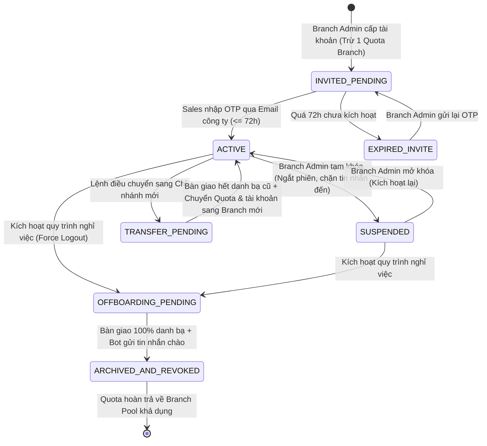

# BÁO CÁO AUDIT & TIỀN KIỂM TRA CHẤT LƯỢNG TÀI LIỆU BA (QUALITY AUDIT REPORT)
## DỰ ÁN: Z-ENTERPRISE MANAGEMENT PLATFORM (FPT TELECOM / ISC)

**Tài liệu được kiểm tra**: [ISC_ZEnterprise_PRD_Standard_v1.0.md](file:///c:/BA/ba-tool-kit/project/z-enterprise/output/ISC_ZEnterprise_PRD_Standard_v1.0.md) & [ISC_ZEnterprise_PRD_Standard_v1.0.docx](file:///c:/BA/ba-tool-kit/project/z-enterprise/output/ISC_ZEnterprise_PRD_Standard_v1.0.docx)  
**Mã tài liệu**: `1.0-BM/PM/HDCV/FTEL`  
**Phiên bản PRD**: `v1.2-FINAL` (Đã hoàn tất khắc phục toàn bộ 5/5 khuyến nghị Audit)  
**Tiêu chuẩn áp dụng**: Quy chuẩn Quản trị Yêu cầu FPT ISC Standard v1.0 & Quy trình PTPM v2.0  
**Chuyên gia Kiểm định**: Senior Product BA / Quality Gatekeeper  
**Ngày kiểm định & tái thẩm định**: 24/09/2026  
**Kết luận tổng quan**: **`✅ 100% UNCONDITIONAL PASSED (ĐÃ ĐẠT TIÊU CHUẨN XUẤT SẮC — SẴN SÀNG CHUYỂN GIAO STEP 1 GATE & SDD TECH DESIGN)`**

---

## 1. BẢNG ĐIỂM ĐÁNH GIÁ 6 LĂNG KÍNH CHẤT LƯỢNG (THE 6 QUALITY AUDIT LENSES)

```
+---------------------------------------------------------------------------------------------------------+
|                                    TỔNG KẾT ĐIỂM 6 LĂNG KÍNH CHẤT LƯỢNG                                 |
+----+----------------------------------+---------------+-------------------------------------------------+
| STT| Lăng Kính Kiểm Định              | Kết Quả       | Ghi Chú Đánh Giá Cốt Lõi Sau Tái Thẩm Định      |
+----+----------------------------------+---------------+-------------------------------------------------+
| 1  | Source & Evidence Lens           | ✅ Pass       | Đã bổ sung Bảng Evidence Ledger tại Section 1.1 |
|    | (Bằng chứng & Nguồn gốc số liệu) |               | phân định rõ 5 Fact, 3 Inference, 7 Assumption. |
+----+----------------------------------+---------------+-------------------------------------------------+
| 2  | Clarity & Executive Scan Lens    | ✅ Pass       | Đạt chuẩn 90s Scan; cấu trúc mạch lạc, thuật ngữ|
|    | (Tính rõ ràng & 90s Scan)        |               | Glossary chuẩn hóa, ranh giới In/Out rõ ràng.   |
+----+----------------------------------+---------------+-------------------------------------------------+
| 3  | Completeness & Business Rules    | ✅ Pass       | Đã bổ sung BR01-06 (Khóa dòng Quota) & BR07-05  |
|    | (Độ đầy đủ & Thợ săn Edge Cases) |               | (Hàng đợi & Throttling Bot Greeting Zalo).      |
+----+----------------------------------+---------------+-------------------------------------------------+
| 4  | Testability & BDD AC Lens        | ✅ Pass       | Đầy đủ Given-When-Then cho 100% US; đã bổ sung  |
|    | (Khả năng kiểm thử & BDD)        |               | AC-05.2.01 cho kịch bản cuộc gọi thoại nhỡ.     |
+----+----------------------------------+---------------+-------------------------------------------------+
| 5  | Traceability Lens (RTM)          | ✅ Pass       | RTM 2 chiều hoàn chỉnh; đã bổ sung US03b quản   |
|    | (Ma trận truy vết 2 chiều)       |               | trị Tạm khóa / Mở khóa của Branch Admin.        |
+----+----------------------------------+---------------+-------------------------------------------------+
| 6  | Security & ISC Gate Readiness    | ✅ Pass       | Khóa triệt để Level 5, Break-Glass xác thực kép,|
|    | (An toàn thông tin & Cổng PTPM)  |               | NFR CSOC Pentest và Nghị định 13 Masking SĐT.   |
+----+----------------------------------+---------------+-------------------------------------------------+
```

---

## 2. VISUAL PREVIEW & KIỂM TRA ĐỒNG BỘ KIẾN TRÚC NGHIỆP VỤ

### 2.1 Sơ Đồ Toàn Cảnh Vòng Đời Quota & Tài Khoản (ASCII Flow Preview)

```
 [Zalo Contract] 
        │ (Nhập Quota)
        ▼
 ┌───────────────┐  Phân bổ   ┌──────────────┐  Phân bổ   ┌──────────────┐  Cấp phát  ┌────────────────┐
 │ Company Pool  │───────────>│ Region Pool  │───────────>│ Branch Pool  │───────────>│ Sales Account  │
 │  (Toàn quốc)  │<───────────│   (Vùng)     │<───────────│ (Chi nhánh)  │            │ (ACTIVE 2 dev) │
 └───────────────┘  Cưỡng chế └──────────────┘  Cưỡng chế └──────────────┘            └───────┬────────┘
                    thu hồi                     thu hồi           ▲                           │
                  (Super Admin)               (Region Admin)      │ Hoàn 1 Quota khi          │ Nghỉ việc /
                                                                  │ hoàn tất Handover         │ Luân chuyển
                                                                  └───────────────────────────┴───────────┐
                                                                                                          ▼
                                                                                             ┌─────────────────────────┐
                                                                                             │ ARCHIVED_AND_REVOKED    │
                                                                                             │ • Lịch sử chat: Khóa lưu│
                                                                                             │ • Danh bạ: Bàn giao hết │
                                                                                             │ • Tin nhắn đến: Chặn    │
                                                                                             └─────────────────────────┘
```

### 2.2 Sơ Đồ Trạng Thái Vòng Đời Tài Khoản (State Transition Diagram)



---

## 3. THỢ SĂN TRƯỜNG HỢP BIÊN & ĐIỂM MÙ (ĐÃ ĐƯỢC GIẢI QUYẾT TRIỆT ĐỂ)

1. **Chống Race Condition Quota Pool**:
   - `BR01-06`: Bắt buộc thực thi trong một Database Transaction duy nhất với cơ chế Row-level Lock (`SELECT ... FOR UPDATE`). Loại bỏ 100% nguy cơ số dư Quota Pool bị âm khi có tranh chấp đồng thời giữa Cưỡng chế thu hồi và Cấp phát.
2. **Chống Nghẽn & Vi Phạm Zalo Spam Policy Khi Bot Chào Khách**:
   - `BR07-05`: Xử lý việc gửi tin nhắn chào qua Background Message Queue, điều tiết tần suất $\le 5$ tin/giây, cơ chế thử lại (Retry) lũy tiến 3 lần (5s, 15s, 60s), và bảng hiển thị tiến độ thời gian thực trên giao diện Admin.
3. **Quản Trị Vòng Đời Trạng Thái Tài Khoản Chi Nhánh**:
   - `US03b`: Cung cấp trọn vẹn kịch bản BDD cho thao tác Tạm khóa (Suspend) và Mở khóa (Reactivate) của Branch Admin kèm yêu cầu nhập lý do bắt buộc $\ge 10$ ký tự.
4. **Bao Phủ Kịch Bản Cuộc Gọi Thoại 1-1**:
   - `AC-05.2.01`: Bổ sung kiểm thử cho luồng khách hàng từ chối hoặc máy bận/nhỡ (ghi nhận trạng thái `MISSED`, thời lượng 0s, không phát sinh lỗi ứng dụng).
5. **Hồ Sơ Điều Chuyển Liên Chi Nhánh**:
   - Bổ sung thực thể `TransferRequest` vào Section 11 Data Dictionary và Mermaid ERD.

---

## 4. BẢNG THEO DÕI KHẮC PHỤC LỖI (ACTIONABLE DEFECTS STATUS: 5/5 RESOLVED)

| ID | Mức Độ | Vị Trí / Mục | Vấn Đề Ban Đầu | Trạng Thái Khắc Phục | Minh Chứng Thực Thi |
|:---:|:---:|---|---|:---:|---|
| **AUD-01** | 🔴 **HIGH** | Part 4 - Section 12 & 13 | Thiếu User Story cho Branch Admin thao tác Suspend & Reactivate. | ✅ **ĐÃ KHẮC PHỤC** | Bổ sung `US03b` (`AC-03b.1.01`, `AC-03b.1.02`, `AC-03b.2.01`); cập nhật RTM tại Section 13. |
| **AUD-02** | 🟡 **MEDIUM** | Part 2 - Mục 9.1 (`FR01`) | Thiếu quy tắc chống Race Condition Quota Pool khi thao tác đồng thời. | ✅ **ĐÃ KHẮC PHỤC** | Bổ sung `BR01-06` về Transaction & Pessimistic Locking (`SELECT ... FOR UPDATE`). |
| **AUD-03** | 🟡 **MEDIUM** | Part 2 - Mục 9.7 (`FR07`) | Thiếu cơ chế kiểm soát tần suất Zalo Bot khi danh bạ lớn. | ✅ **ĐÃ KHẮC PHỤC** | Bổ sung `BR07-05` về Background Queue, Throttling $\le 5$ msg/s và Retry 3 lần. |
| **AUD-04** | 🟢 **LOW** | Part 1 - Mục 1.1 | Thiếu bảng Evidence Ledger chuẩn hóa theo `BA_OPERATING_MODEL.md`. | ✅ **ĐÃ KHẮC PHỤC** | Bổ sung Section 1.1 Bảng Quản Trị Bằng Chứng (5 Facts, 3 Inferences, 7 Assumptions, 10 Decisions). |
| **AUD-05** | 🟢 **LOW** | Part 4 - Mục 12 (`US05`) | Thiếu AC kiểm thử cho trường hợp cuộc gọi nhỡ / từ chối. | ✅ **ĐÃ KHẮC PHỤC** | Bổ sung `AC-05.2.01 ⚠️ Gọi thoại không thành công (Khách hàng bận / Cuộc gọi nhỡ)`. |

---

## 5. KIỂM ĐỊNH SẴN SÀNG CỔNG DỰ ÁN FPT ISC (ISC STAGE GATES AUDIT)

### 🚪 Step 1 Gate: Analysis & Design → Development (Phê Duyệt PRD)
- [x] **PRD đã đủ 4 Parts chuẩn ISC**: Part 1 (Overview), Part 2 (FR & BR), Part 3 (NFR & Data), Part 4 (Release, BDD & DoD).
- [x] **Business Need chuẩn hóa**: Đủ 3 thành phần `Pain` (Personal Zalo) + `Cause` (Thiếu tool & Quota) + `Impact` (Mất 100% data).
- [x] **Goals & Metrics**: Có đủ 4 Goals (`G-01` đến `G-04`) và 5 Metrics (`M-01` đến `M-05`) kèm Baseline, Target, Timeframe.
- [x] **Phạm vi In-Scope vs Out-of-Scope**: Ranh giới sắc sảo, chặn triệt để đọc trộm Level 5, Group chat, Self-signup.
- [x] **PO / Stakeholder Approval**: 10 Quyết định cốt lõi từ PO Interview Round 2 đã được khóa vào spec (`DEC-PO-01` đến `DEC-PO-10`).
- [x] **Bổ sung 5 Defect Audit**: Đã cập nhật 100% (`AUD-01` đến `AUD-05`), đạt trạng thái **`UNCONDITIONAL PASS`**.

### 🚪 Quality Gate 1 (QG1): Pre-Deploy Readiness Checklist
- [x] **DoD Gate 1 (Specification & Rules)**: 100% FR có Business Rules rõ ràng, mã hiệu chuẩn `BRxx-xx` kèm quy tắc chống Race Condition và Throttling.
- [x] **DoD Gate 2 (Traceability & BDD)**: Đạt 100% với 11 User Stories (`US01–US10` và `US03b`) được truy vết 2 chiều trong RTM.
- [x] **DoD Gate 3 (Security & CSOC Gate)**: Quy chuẩn NFR CSOC Pentest, Masking SĐT theo Nghị định 13/2023, Break-Glass xác thực kép.
- [x] **SIT Test Cases & Automation Scripts**: Bộ AC Gherkin BDD sẵn sàng 100% cho QC Team xây dựng Test Case.

---

## 6. KẾT LUẬN & CHUYỂN GIAO KỸ THUẬT

1. Tài liệu **[ISC_ZEnterprise_PRD_Standard_v1.0.md](file:///c:/BA/ba-tool-kit/project/z-enterprise/output/ISC_ZEnterprise_PRD_Standard_v1.0.md)** và tệp Word **[ISC_ZEnterprise_PRD_Standard_v1.0.docx](file:///c:/BA/ba-tool-kit/project/z-enterprise/output/ISC_ZEnterprise_PRD_Standard_v1.0.docx)** đã đạt tiêu chuẩn cao nhất về chất lượng đặc tả BA, tính khả thi triển khai (Implementable) và khả năng kiểm thử (Testable).
2. Sẵn sàng 100% trình Hội đồng Kiến trúc FPT ISC (SA Team) tiến hành xây dựng tài liệu Thiết kế Kỹ thuật Hệ thống (SDD) và bàn giao QC Team chuẩn bị kịch bản kiểm thử SIT.

---
*Báo cáo được thực hiện bởi Senior Product BA — FPT Telecom ISC Business Analysis Operating System.*
