# BÁO CÁO PHÂN TÍCH VẤN ĐỀ NGHIỆP VỤ & NĂNG LỰC SẢN PHẨM
## Initiative: Zalo Enterprise Channel & Enterprise Account Administration
**Dự án**: Z-Enterprise Platform  
**Phiên bản**: v1.1-ALIGNED  
**Trạng thái Vòng đời (Workflow State)**: `DECIDED` (Toàn bộ Blocking Decisions đã được PO phê duyệt, sẵn sàng viết PRD)  
**Tác giả**: Senior Product BA (Trụ cột 1: `ba-brainstorm-analysis` & Bổ trợ 1: `ba-clarification-harness`)  
**Ranh giới Phân tích**: 100% Business & Product Behavior. Không phân tích codebase, không thiết kế API, Database Schema, Internal Services hay Technical Solution.

---

## MỤC LỤC
1. [A. Business Problem Frame](#a-business-problem-frame)
2. [B. Problem Statement](#b-problem-statement)
3. [C. Desired Outcomes & Success Metrics](#c-desired-outcomes--success-metrics)
4. [D. Actor & Stakeholder Model](#d-actor--stakeholder-model)
5. [E. Domain Concepts & Vocabulary](#e-domain-concepts--vocabulary)
6. [F. Confirmed Scope](#f-confirmed-scope)
7. [G. Proposed Scope (Đã Thẩm Định)](#g-proposed-scope-đã-thẩm-định)
8. [H. Non-Goals & Boundaries](#h-non-goals--boundaries)
9. [I. Super Admin Responsibility & Capability Model](#i-super-admin-responsibility--capability-model)
10. [J. Admin Responsibility & Capability Model (Region vs. Branch)](#j-admin-responsibility--capability-model-region-vs-branch)
11. [K. Sales / Enterprise User Capability Map](#k-sales--enterprise-user-capability-map)
12. [L. Enterprise Activity Visibility Architecture (Approved Level 1-2-3)](#l-enterprise-activity-visibility-architecture-approved-level-1-2-3)
13. [M. Quota Lifecycle State Machine](#m-quota-lifecycle-state-machine)
14. [N. Enterprise Account Lifecycle State Machine](#n-enterprise-account-lifecycle-state-machine)
15. [O. Customer / Contact Relationship & Handover Model](#o-customer--contact-relationship--handover-model)
16. [P. MVP Proposal (Aligned MoSCoW Prioritization)](#p-mvp-proposal-aligned-moscow-prioritization)
17. [Q. Evidence Ledger (E-###, I-###, A-###, Q-###, D-###)](#q-evidence-ledger)
18. [R. BA Proposal Register](#r-ba-proposal-register)
19. [S. PO Decision Backlog & Alignment Log](#s-po-decision-backlog--alignment-log)
20. [T. Recommended Next State & PRD Transition Plan](#t-recommended-next-state--prd-transition-plan)

---

## A. BUSINESS PROBLEM FRAME

### 1. Bối cảnh Vận hành Thực tế (Business Reality)
Hiện nay, đội ngũ Sales của doanh nghiệp sử dụng tài khoản Zalo cá nhân (`Personal Zalo`) để làm kênh giao tiếp, tư vấn, gửi báo giá và chốt hợp đồng với khách hàng. Mặc dù phương thức này giúp Sales linh hoạt tiếp cận khách hàng trên nền tảng nhắn tin phổ biến nhất Việt Nam, nó đặt toàn bộ tài sản dữ liệu và mối quan hệ kinh doanh của doanh nghiệp vào tình trạng phụ thuộc hoàn toàn vào cá nhân Sales.

### 2. Bóc tách Điểm Đau & Phân tích Nguyên nhân Gốc rễ (5 Whys / Ishikawa)
Áp dụng kỹ thuật bóc tách 4 chiều (Con người - Quy trình - Công nghệ - Dữ liệu):

```
                   CON NGƯỜI (PEOPLE)                     QUY TRÌNH (PROCESS)
             Không có ranh giới việc & tư             Quy trình Offboarding thủ công
             Tâm lý "khách hàng của tôi"              Không có bước thu hồi/bàn giao Zalo
                           \                                  /
                            \                                /
                             +------------------------------+
                             |   LỆ THUỘC VÀO ZALO CÁ NHÂN  | ===> MẤT MÁT TÀI SẢN &
                             |   KHÔNG QUẢN TRỊ ĐƯỢC SALES  |      MÙ THÔNG TIN VẬN HÀNH
                             +------------------------------+
                            /                                \
                           /                                  \
             Chưa có giải pháp Enterprise Account       Dữ liệu phân tán trên điện thoại Sales
             Không có công cụ cấp/thu hồi Quota         Doanh nghiệp sở hữu 0% lịch sử trao đổi
                 CÔNG NGHỆ (TECHNOLOGY)                       DỮ LIỆU (DATA)
```

#### Phân tích 5 Whys (Tại sao doanh nghiệp mất trắng khách hàng khi Sales nghỉ việc?):
1. **Why 1**: Tại sao khách hàng tiếp tục liên hệ với Sales cũ thay vì liên hệ công ty khi Sales đã nghỉ?  
   *Trả lời*: Vì khách hàng chỉ biết và kết bạn với tài khoản Zalo cá nhân của Sales đó.
2. **Why 2**: Tại sao Sales lại dùng Zalo cá nhân để đại diện cho công ty giao dịch?  
   *Trả lời*: Vì công ty chưa cung cấp tài khoản làm việc chuyên biệt mang định danh doanh nghiệp (`Enterprise Account`) cho Sales.
3. **Why 3**: Tại sao công ty chưa cấp tài khoản làm việc riêng trên Zalo?  
   *Trả lời*: Vì Zalo consumer thông thường gắn với số điện thoại/SIM cá nhân; doanh nghiệp chưa triển khai kênh Zalo Enterprise và giải pháp quản trị hạn ngạch (`Quota Management`).
4. **Why 4**: Tại sao cấp quản trị (Super Admin, Region Admin, Branch Admin) không thể can thiệp hoặc bàn giao khách hàng?  
   *Trả lời*: Vì không có hệ sinh thái quản lý tài khoản theo cấu trúc tổ chức và không có quyền truy cập vào danh bạ của tài khoản cá nhân.
5. **Why 5 (Root Cause)**: Doanh nghiệp **thiếu một hệ thống quản trị danh tính và tài khoản làm việc tập trung (Enterprise Identity & Account Governance)** trên kênh Zalo, dẫn đến việc tài sản số của công ty bị đồng hóa với tài sản đời tư của nhân viên.

### 3. Áp dụng Kỹ thuật Tư duy Gỡ Bế tắc (Cognitive Problem-Solving)

#### Kỹ thuật 1: Simplification Cascades (Thác Đổ Đơn Giản Hóa)
- *Insight Cốt Lõi*: **"Tài khoản Zalo Enterprise là một công cụ lao động (Tool of Trade) do công ty cho mượn, chứ không phải danh tính pháp nhân của cá nhân Sales."**
- *Tác động triệt tiêu sự phức tạp*:
  - Không cần xây dựng cơ chế phân định "tin nhắn nào là việc, tin nhắn nào là riêng tư" bên trong tài khoản Enterprise.
  - Toàn bộ liên hệ, bạn bè, lịch sử được tạo lập trên tài khoản Enterprise mặc nhiên là tài sản phục vụ công việc của doanh nghiệp.
  - Zalo cá nhân được tách biệt 100% ra khỏi hệ thống (`Out-of-Scope`), triệt tiêu hoàn toàn rủi ro pháp lý về xâm phạm quyền riêng tư của nhân viên.

#### Kỹ thuật 2: Inversion Exercise (Tư Duy Đảo Ngược)
- *Câu hỏi Đảo ngược*: **"Làm thế nào để dự án Zalo Enterprise này thất bại thảm hại nhất?"**
  1. *Thất bại 1*: Ép Sales dùng tài khoản Enterprise nhưng Admin đọc trộm từng dòng tin nhắn trò chuyện hàng ngày -> Sales phản kháng, tìm cách lách qua Zalo cá nhân, tỷ lệ adoption bằng 0.
  2. *Thất bại 2*: Cấp phát tài khoản phức tạp, mất cả tuần mới xong 1 tài khoản, Sales mới không có công cụ bán hàng.
  3. *Thất bại 3*: Quota bị giữ lãng phí ở các Vùng/Chi nhánh không có nhu cầu, trong khi Chi nhánh tăng trưởng nóng lại không có quota để cấp cho Sales.
  4. *Thất bại 4*: Khi Sales nghỉ việc, tài khoản bị xóa sạch hoặc không ai tiếp quản, khách hàng nhắn tin rơi vào "hố đen".
- *Hành động Phòng ngừa*:
  - Thiết kế quy trình cấp phát Quota & Account tức thì (Real-time Provisioning).
  - Tách bạch rõ giữa Quản trị Hoạt động (Governance) và Xâm phạm Vi mô (Micromanagement). Ưu tiên Visibility ở mức Danh bạ khách hàng và Metadata thay vì đọc trộm nội dung (Đã được PO chốt qua `DEC-02`).
  - Xây dựng quy trình bàn giao khách hàng (`Customer Handover`) rõ ràng trước khi đóng/thu hồi tài khoản (`DEC-01`).

---

## B. PROBLEM STATEMENT

| Yếu Tố | Đặc Tả Chi Tiết |
|---|---|
| **Hiện trạng (As-Is)** | Doanh nghiệp phân phối quy mô lớn với mạng lưới phân cấp (Company → Region → Branch) đang để đội ngũ Sales sử dụng 100% tài khoản Zalo cá nhân để giao tiếp, tư vấn và duy trì quan hệ với khách hàng. |
| **Vấn đề cốt lõi (Core Problem)** | 1. **Mất trắng tài sản khách hàng**: Khi Sales nghỉ việc hoặc chuyển công tác, toàn bộ thông tin liên hệ và lịch sử tư vấn đều biến mất cùng Sales.<br/>2. **Mù thông tin vận hành**: Quản lý các cấp (Admin/Super Admin) không có khả năng nắm bắt Sales nào đang làm việc với khách hàng nào.<br/>3. **Thiếu cơ chế quản trị tập trung**: Không có năng lực phân bổ, điều phối quota và quản trị vòng đời tài khoản làm việc theo cây tổ chức. |
| **Hậu quả nếu không giải quyết (Impact)** | Rò rỉ thông tin khách hàng sang đối thủ cạnh tranh, gián đoạn dịch vụ nghiêm trọng khi biến động nhân sự, lãng phí chi phí tìm kiếm khách hàng mới, giảm uy tín thương hiệu do không chuẩn hóa kênh giao tiếp chính thức. |

---

## C. DESIRED OUTCOMES & SUCCESS METRICS

### 1. Desired Business & Product Outcomes
- **Outcome 1 (Asset Protection)**: 100% dữ liệu danh bạ khách hàng và lịch sử tương tác phát sinh trong công việc được lưu giữ và thuộc quyền sở hữu/quản trị của doanh nghiệp (`D-011`).
- **Outcome 2 (Zero Personal Dependency)**: Tách rời hoàn toàn hoạt động bán hàng của công ty ra khỏi Zalo cá nhân của Sales (`D-003`).
- **Outcome 3 (Centralized Quota Governance)**: Super Admin nắm quyền kiểm soát tập trung 100% hạn ngạch (quota) từ Zalo và phân bổ linh hoạt theo nhu cầu thực tế của từng Region và Branch (`D-001`, `D-008`).
- **Outcome 4 (Operational Visibility with Privacy Guard)**: Admin các cấp nắm bắt được danh sách khách hàng và tần suất tương tác của Sales (Level 1 + 2 + 3) mà không cần xâm phạm nội dung tin nhắn (`D-012`).

### 2. Success Metrics (Thước Đo Thành Công)

| Mã Đo Lường | Tên Chỉ Số | Công Thức / Cách Đo | Target MVP |
|---|---|---|---|
| `M-01` | **Quota Utilization Rate** | `(Tổng Quota đang Active / Tổng Quota được Zalo cấp) * 100` | ≥ 90% |
| `M-02` | **Sales Adoption Rate** | `(Số Sales kích hoạt Z-Enterprise / Tổng Sales được cấp) * 100` trong tuần đầu | ≥ 95% |
| `M-03` | **Offboarding Transition Time** | Thời gian từ khi Sales nghỉ việc đến khi tài khoản được khóa & danh bạ được tiếp nhận | ≤ 4 giờ làm việc |
| `M-04` | **Customer Coverage Visibility** | Tỷ lệ khách hàng phát sinh hội thoại có ghi nhận danh bạ trên hệ thống quản trị | 100% |
| `M-05` | **Quota Distribution Lead Time** | Thời gian điều chuyển quota từ Company Pool xuống Branch Pool | Tức thì (Real-time) |

---

## D. ACTOR & STAKEHOLDER MODEL

```
                                +---------------------------+
                                |  NHÀ CUNG CẤP (ZALO)      |
                                +---------------------------+
                                              | Cấp Quota hợp đồng
                                              v
                                +---------------------------+
                                |     SUPER ADMIN (HQ)      |
                                |  (Toàn quyền Doanh nghiệp)|
                                +---------------------------+
                                              | Phân bổ Quota Vùng
                                              v
                                +---------------------------+
                                |    REGION ADMIN (Vùng)    |
                                |    (Ví dụ: DNB, Tây Nguyên)
                                +---------------------------+
                                              | Phân bổ Quota Chi nhánh
                                              v
                                +---------------------------+
                                |   BRANCH ADMIN (Chi nhánh)|
                                |    (Ví dụ: HCM01, HCM02)  |
                                +---------------------------+
                                              | Gán Account, Giám sát, Handover
                                              v
                                +---------------------------+
                                |   SALES (Enterprise User) |
                                |  (Login bằng Company Email)
                                +---------------------------+
                                              | Trao đổi công việc
                                              v
                                +---------------------------+
                                |    CUSTOMER (Khách hàng)  |
                                +---------------------------+
```

### Chi tiết Trách nhiệm & Biên giới Quyền hạn của các Actor:

| Actor | Phạm vi Quản trị (Boundary) | Trách nhiệm Cốt lõi (Core Responsibilities) | Quyền hạn Thao tác (Operational Authority) |
|---|---|---|---|
| **Super Admin** | Toàn bộ Doanh nghiệp (Company-wide) | • Quản trị tổng Quota được Zalo cấp.<br/>• Quản trị cấu trúc tổ chức Vùng & Chi nhánh.<br/>• Quản trị tài khoản Admin các cấp.<br/>• Bảo đảm tuân thủ và audit toàn diện. | • Tiếp nhận, phân bổ, thu hồi Quota về Company Pool.<br/>• Tạo, phân quyền, khóa tài khoản Region Admin & Branch Admin.<br/>• Xem dashboard và audit log toàn quốc.<br/>• Can thiệp cưỡng chế trong các trường hợp tranh chấp/ngoại lệ. |
| **Region Admin** | Khu vực / Vùng phụ trách (vd: DNB, Tây Nguyên) | • Tối ưu hóa hiệu quả sử dụng Quota trong Vùng.<br/>• Cân đối và điều phối Quota giữa các Branch trực thuộc.<br/>• Giám sát hoạt động kinh doanh cấp vùng. | • Tiếp nhận Quota từ Super Admin.<br/>• Phân bổ Quota cho các Branch trực thuộc.<br/>• Thu hồi Quota nhàn rỗi từ Branch về Region Pool.<br/>• Xem báo cáo tổng hợp và audit log trong phạm vi Region. |
| **Branch Admin** | Chi nhánh trực thuộc (vd: HCM01, HCM02) | • Quản trị trực tiếp việc cấp phát tài khoản cho Sales.<br/>• Quản lý vòng đời tài khoản Sales của Chi nhánh.<br/>• Giám sát mối quan hệ khách hàng & Metadata tương tác của Sales.<br/>• Thực hiện bàn giao khách hàng khi nhân sự biến động. | • Gán (Assign) Quota thành Enterprise Account cho Sales (qua email công ty).<br/>• Kích hoạt, tạm đình chỉ (Suspend), kích hoạt lại hoặc thu hồi (Revoke) tài khoản Sales.<br/>• Xem danh bạ và chỉ số tương tác (Level 1, 2, 3) của Sales trong Branch.<br/>• Cưỡng chế phân bổ lại danh bạ khách hàng cho Sales kế nhiệm (`D-011`). |
| **Sales** | Cá nhân được phân công | • Sử dụng tài khoản Z-Enterprise để tư vấn, bán hàng, chăm sóc khách hàng.<br/>• Đại diện cho uy tín doanh nghiệp khi giao tiếp.<br/>• Tuân thủ nội quy bảo mật thông tin kinh doanh. | • Đăng nhập bằng Email công ty trên tối đa 2 thiết bị (`D-014`).<br/>• Kết bạn, nhắn tin, gọi thoại, gửi tài liệu báo giá cho khách hàng.<br/>• Quản lý danh bạ khách hàng phục vụ công việc.<br/>• Tự chịu trách nhiệm về nội dung trao đổi và danh sách liên hệ. |
| **Customer** | Bên ngoài doanh nghiệp | • Tiếp nhận tư vấn, trao đổi công việc, nhận báo giá và thông tin sản phẩm. | • Sử dụng ứng dụng Zalo thông thường để kết nối với tài khoản Enterprise của Sales. |

---

## E. DOMAIN CONCEPTS & VOCABULARY

| Thuật Ngữ | Tên Tiếng Anh | Định Nghĩa Chuẩn Nghiệp Vụ |
|---|---|---|
| **Hạn ngạch** | `Quota` | Đơn vị định mức tài khoản do Zalo cấp theo hợp đồng. Nguyên tắc 1-1: **1 Quota = 1 Tài khoản Zalo Enterprise** có thể cấp cho 1 Sales (theo `D-001`). |
| **Tài khoản Doanh nghiệp** | `Enterprise Account` | Tài khoản Zalo độc lập do công ty sở hữu, đăng ký và xác thực bằng Email công ty, giao cho Sales sử dụng phục vụ công việc (theo `D-003`, `D-004`). |
| **Zalo Cá nhân** | `Personal Zalo` | Tài khoản Zalo riêng của cá nhân Sales, hoàn toàn nằm ngoài phạm vi quản trị và truy cập của hệ thống Z-Enterprise (theo `D-003`). |
| **Cây Tổ chức** | `Organization Hierarchy` | Mô hình phân cấp quản lý doanh nghiệp gồm đúng 3 cấp cố định: **Company → Region → Branch → Sales** (theo `D-008`). |
| **Bể Hạn ngạch** | `Quota Pool` | Lượng Quota khả dụng chưa gán tại từng cấp quản lý (`Company Quota Pool`, `Region Quota Pool`, `Branch Quota Pool`). |
| **Tài khoản Đã gán** | `Assigned Account` | Tài khoản Enterprise đã được liên kết với một Sales cụ thể thông qua Email công ty (theo `D-002`). |
| **Dữ liệu Đặc tính Tương tác** | `Interaction Metadata` | Dữ liệu mô tả hành vi giao tiếp (thời điểm nhắn tin gần nhất, số lượng tin nhắn, thời lượng cuộc gọi) mà **không bao gồm nội dung văn bản hay tệp đính kèm** (`D-012`). |
| **Bàn giao Khách hàng** | `Customer Handover` | Nghiệp vụ chuyển giao quyền tiếp cận và chăm sóc danh bạ khách hàng từ một Sales cũ sang một Sales mới do Branch Admin thực hiện (`D-011`). |

---

## F. CONFIRMED SCOPE

1. **Nguyên tắc Quota 1-1 (`D-001`)**: 1 quota tương ứng chính xác với 1 tài khoản Zalo Enterprise có thể kích hoạt cho 1 Sales.
2. **Định mức Sales (`D-002`)**: Mỗi Sales chỉ được sở hữu duy nhất 1 tài khoản Zalo Enterprise đang kích hoạt.
3. **Sở hữu & Tách biệt Đời tư (`D-003`)**: Enterprise Account thuộc sở hữu công ty, độc lập hoàn toàn với Personal Zalo. Hệ thống không can thiệp vào Personal Zalo.
4. **Phương thức Định danh (`D-004`)**: Sử dụng Email công ty làm định danh đăng nhập và nhận thông báo kích hoạt.
5. **Đồng bộ Đa Nền tảng & Giới hạn Phiên (`D-005`, `D-014`)**: Đồng bộ dữ liệu phiên làm việc; giới hạn tối đa **02 thiết bị đồng thời** (01 PC/Web + 01 Mobile App).
6. **Trách nhiệm Tài khoản (`D-006`)**: Sales tự chịu trách nhiệm về người kết bạn, nội dung trao đổi; doanh nghiệp có toàn quyền quản trị tài khoản Enterprise.
7. **Cấu trúc Tổ chức (`D-008`)**: Cấu trúc 3 cấp quản trị: `Company` (Super Admin) → `Region` (Region Admin) → `Branch` (Branch Admin) → `Sales`.
8. **Quyền sở hữu Danh bạ & Bàn giao (`D-011`)**: 100% danh bạ trên Enterprise Account thuộc công ty. Branch Admin có quyền bàn giao danh bạ khi Sales nghỉ việc.
9. **Cấp độ Visibility Phê duyệt (`D-012`)**: Hỗ trợ **Level 1 (Trạng thái) + Level 2 (Danh bạ Khách hàng) + Level 3 (Interaction Metadata)** cho Admin. Khóa quyền đọc nội dung tin nhắn thường nhật (Level 5).
10. **Chính sách Tái sử dụng Tài khoản (`D-013`)**: Khi Sales nghỉ việc, Archive tài khoản cũ, thu hồi Quota về Branch Pool để cấp Account mới tinh cho Sales tuyển mới.

---

## G. PROPOSED SCOPE (ĐÃ THẨM ĐỊNH)

1. **Quản trị Luân chuyển Quota Đa cấp**: Cơ chế cấp phát, thu hồi Quota linh hoạt giữa Company ↔ Region ↔ Branch để chống tình trạng tồn đọng Quota nhàn rỗi (`BAP-02`).
2. **Quy trình Handover Bán tự động**: Giao diện trực quan cho Branch Admin chọn một hoặc nhiều Sales trong Branch để phân bổ lại danh sách khách hàng từ Sales đã nghỉ.
3. **Hệ thống Cảnh báo SLA Tương tác**: Cảnh báo trên dashboard Branch Admin đối với các khách hàng quá 48h chưa được Sales phản hồi (dựa trên Metadata tương tác của Level 3).
4. **Audit Trail Tập trung**: Ghi nhận toàn bộ vết thao tác: Cấp quota, thu hồi, gán account, thay đổi trạng thái tài khoản và các lượt handover danh bạ.

---

## H. NON-GOALS & BOUNDARIES

1. **Tuyệt đối KHÔNG can thiệp Personal Zalo**: Không đọc danh bạ cá nhân, không truy vết tin nhắn cá nhân, không yêu cầu liên kết số điện thoại cá nhân vào hệ thống.
2. **Không làm Full-fledged CRM**: Không xây dựng hệ thống quản lý cơ hội kinh doanh phức tạp, báo cáo doanh thu tài chính chuyên sâu, phễu bán hàng đa kênh. Trọng tâm là **Quản trị Kênh Zalo, Quản trị Quota & Tài khoản, và Điểm kết nối Khách hàng**.
3. **Không đọc trộm nội dung tin nhắn thường nhật (No Message Snooping)**: Branch Admin không được cung cấp giao diện đọc toàn bộ nội dung tin nhắn của Sales với khách hàng (`D-012`).
4. **Không tự thiết kế Kiến trúc Kỹ thuật (Engineering Boundary)**: BA không thiết kế Database Schema, cơ chế WebSocket đồng bộ, giải pháp mã hóa tin nhắn hay Internal API.
5. **Không tự thêm Tầng Tổ chức**: Không bổ sung các cấp trung gian như "Cụm chi nhánh", "Phòng ban", "Tổ/Đội" ngoài 3 cấp đã xác nhận (`D-008`).
6. **Không hỗ trợ Đăng ký Tự do (No Self-service Signup)**: Sales không thể tự đăng ký tài khoản Enterprise nếu không được Branch Admin phân công và định danh qua Email công ty.

---

## I. SUPER ADMIN RESPONSIBILITY & CAPABILITY MODEL

### 1. Trách nhiệm Cốt lõi (Responsibilities)
- Đại diện doanh nghiệp tiếp nhận tổng Quota từ Zalo.
- Bảo đảm tỷ lệ sử dụng Quota toàn diện (`Utilization Rate`) đạt mức tối ưu.
- Quản trị mô hình phân cấp tổ chức toàn quốc.
- Phê duyệt và giám sát việc phân quyền cho các Region Admin.
- Xử lý các tranh chấp, khiếu nại và trường hợp ngoại lệ liên Vùng.
- Duy trì an toàn thông tin và lưu trữ nhật ký tuân thủ (Audit Trail).

### 2. Danh mục Năng lực Đề xuất (Capability Proposal)

| Mã Năng Lực | Tên Năng Lực | Mô Tả Nghiệp Vụ | Rationale (Tại sao Doanh nghiệp cần?) |
|---|---|---|---|
| `CAP-SA-01` | **Tổng Nhập & Quản trị Quota Doanh nghiệp** | Nhập số lượng Quota ký kết với Zalo; theo dõi tổng Quota khả dụng, đã phân bổ, đang sử dụng và còn trống ở Company Pool. | Doanh nghiệp phải nắm được tài sản license đã mua để tránh thất thoát và chuẩn bị kế hoạch tái ký/mở rộng. |
| `CAP-SA-02` | **Phân bổ & Thu hồi Quota Vùng** | Thao tác chuyển Quota từ Company Pool cho từng Region Pool; thu hồi Quota thừa từ Region về Company Pool. | Điều tiết nguồn lực linh hoạt theo quy mô kinh doanh của từng vùng miền. |
| `CAP-SA-03` | **Quản trị Danh mục Cây Tổ chức** | Tạo mới, đổi tên, đóng hoặc chuyển trạng thái hoạt động của các Region và Branch. | Giữ cho hệ thống luôn phản ánh chính xác cơ cấu tổ chức kinh doanh ngoài đời thực. |
| `CAP-SA-04` | **Quản trị Phân quyền Admin** | Tạo tài khoản, chỉ định người dùng giữ vai trò Region Admin và Super Admin phụ; khóa/thu hồi quyền Admin. | Phân định trách nhiệm rõ ràng, kiểm soát quyền truy cập hệ thống cấp cao nhất. |
| `CAP-SA-05` | **Điều phối Ngoại lệ & Tranh chấp Liên Vùng** | Phê duyệt chuyển Sales giữa 2 Region khác nhau; cưỡng chế thu hồi tài khoản khi có dấu hiệu vi phạm pháp luật. | Giải quyết các điểm nghẽn mà cấp Vùng không đủ thẩm quyền xử lý. |
| `CAP-SA-06` | **Giám sát Dashboard & Audit Log Toàn quốc** | Xem báo cáo phân bổ Quota, tỷ lệ kích hoạt tài khoản theo Vùng/Chi nhánh, và tra cứu nhật ký thao tác toàn hệ thống. | Bảo đảm tính minh bạch, phục vụ kiểm toán nội bộ và đánh giá hiệu quả đầu tư. |

---

## J. ADMIN RESPONSIBILITY & CAPABILITY MODEL (REGION VS. BRANCH)

### 1. Ma trận Trách nhiệm & Ranh giới Thao tác

| Nhóm Nghiệp Vụ | Thao tác Cụ thể | Region Admin | Branch Admin | Ghi chú & Quy tắc Phân quyền |
|---|---|:---:|:---:|---|
| **Quản trị Quota** | Nhận Quota từ cấp trên | ✅ (Từ Super Admin) | ✅ (Từ Region Admin) | Nhận về Pool của cấp mình. |
| | Phân bổ Quota cho cấp dưới | ✅ (Cho các Branch) | ❌ (Không có cấp con) | Branch chỉ phân bổ thành Account cho Sales. |
| | Thu hồi Quota nhàn rỗi | ✅ (Thu từ Branch về) | ❌ | Thu hồi quota chưa gán về Region Pool. |
| | Yêu cầu cấp thêm Quota | Escalate Super Admin | Escalate Region Admin | Khi Pool cạn kiệt. |
| **Quản trị Tài khoản** | Gán Quota thành Enterprise Account | ❌ | ✅ | Gán đích danh theo Email công ty của Sales. |
| | Gửi lời mời / Kích hoạt lại | ❌ | ✅ | Tương tác trực tiếp với Sales. |
| | Tạm khóa tài khoản (Suspend) | ⚠️ (Chỉ định / Chỉ đạo) | ✅ (Thực hiện trực tiếp) | Khi Sales nghỉ phép dài hạn hoặc nghi vấn. |
| | Thu hồi tài khoản (Revoke) | ❌ | ✅ | Khi Sales chính thức nghỉ việc. |
| **Biến động Nhân sự** | Chuyển Sales nội bộ Branch | N/A | ✅ | Cập nhật thông tin quản lý nội bộ. |
| | Chuyển Sales giữa 2 Branch trong Vùng | ✅ (Phê duyệt) | ⚠️ (Đề xuất / Tiếp nhận) | Cần sự đồng thuận giữa 2 Branch. |
| | Chuyển Sales sang Vùng khác | Escalate Super Admin | Escalate Region Admin | Vượt thẩm quyền cấp Vùng. |
| **Bàn giao Khách hàng** | Gán lại danh bạ khách hàng cho Sales mới | ❌ | ✅ | Thực hiện cưỡng chế theo `D-011`. |
| **Giám sát & Báo cáo** | Báo cáo sử dụng Quota | Toàn Region | Toàn Branch | Theo phạm vi được giao. |
| | Danh sách Sales & Trạng thái Account | Toàn Region | Toàn Branch | Giám sát trạng thái hoạt động (Level 1). |
| | Danh sách Khách hàng của Sales | Mức tổng hợp / Thống kê | Xem chi tiết danh bạ | Giám sát danh bạ chi nhánh (Level 2). |
| | Metadata Tương tác & SLA Phản hồi | Báo cáo tổng hợp SLA Vùng | Xem chi tiết từng Sales | Giám sát hiệu suất tư vấn (Level 3 - `D-012`). |

---

## K. SALES / ENTERPRISE USER CAPABILITY MAP

```
                               SALES ENTERPRISE CAPABILITIES
                                             |
         +-----------------------------------+-----------------------------------+
         |                                   |                                   |
         v                                   v                                   v
   [MUST HAVE - MVP]                [SHOULD HAVE - Phase 2]             [LATER - Future]
• Đăng nhập bằng Company Email      • Trả lời nhanh mẫu (Quick Reply)   • Broadcast theo nhóm khách
• Giới hạn 2 thiết bị (PC + Mobile) • Phân loại tag khách hàng chuẩn    • Mini-app gửi form báo giá
• Tìm kiếm khách hàng qua SĐT/QR    • Nhắc việc & Đặt lịch hẹn          • Chatbot trả lời ngoài giờ
• Chat 1-1 văn bản, ảnh, tệp tin    • Bàn giao danh bạ chủ động         • Tích hợp CRM đồng bộ Lead
• Nhận/Gọi thoại công việc
• Danh bạ khách hàng công việc
• Đồng bộ PC / Web / Mobile
```

### Chi tiết Phân loại Năng lực Sales:

| Nhóm Năng Lực | Tên Năng Lực Cụ Thể | Phân Loại | Rationale & Giá Trị Nghiệp Vụ |
|---|---|:---:|---|
| **Identity & Access** | Đăng nhập/Xác thực bằng Email công ty | **MUST HAVE** | Bảo đảm chỉ nhân viên công ty mới có quyền truy cập kênh giao tiếp doanh nghiệp (`D-004`). |
| | Duy trì phiên đồng thời tối đa 2 thiết bị (PC + Mobile) | **MUST HAVE** | Sales vừa làm việc văn phòng vừa đi thị trường; kiểm soát an toàn phiên (`D-005`, `D-014`). |
| **Communication** | Nhắn tin văn bản, biểu cảm (Emoji) | **MUST HAVE** | Năng lực giao tiếp nền tảng bắt buộc để trao đổi công việc. |
| | Gửi hình ảnh sản phẩm & Tệp tài liệu (PDF, Excel, Word) | **MUST HAVE** | Nghiệp vụ bán hàng bắt buộc phải gửi hình catalogue, bảng báo giá, hợp đồng nháp. |
| | Gọi thoại (Audio Call) với khách hàng | **MUST HAVE** | Chốt đơn và giải quyết vấn đề cấp bách cần gọi điện trực tiếp qua Zalo. |
| **Contact Management**| Tìm kiếm & Kết bạn với khách hàng qua SĐT / Mã QR | **MUST HAVE** | Phương thức chủ yếu để Sales kết nối với khách hàng mới. |
| | Quản lý Danh bạ Khách hàng công việc (Đổi tên gợi nhớ) | **MUST HAVE** | Giúp Sales ghi nhớ thông tin công ty, chức danh khách hàng. |
| **Productivity** | Bộ tin nhắn mẫu trả lời nhanh (Quick Replies) | **SHOULD HAVE** | Tăng tốc độ phản hồi các câu hỏi lặp lại (thông tin tài khoản, chính sách bảo hành). |
| | Phân loại Khách hàng theo Tag chuẩn công ty | **SHOULD HAVE** | Phân nhóm khách hàng (vd: Khách VIP, Đại lý, Khách tiềm năng) phục vụ quản lý. |
| | Lịch hẹn & Nhắc việc chăm sóc khách hàng | **SHOULD HAVE** | Giúp Sales không bỏ quên lịch hẹn tư vấn hoặc hạn thanh toán công nợ. |
| **Advanced Tools** | Gửi tin nhắn hàng loạt theo nhóm (Broadcast) | **LATER** | Chăm sóc khách hàng định kỳ (thông báo khuyến mãi) tuân thủ chính sách Zalo. |
| | Tích hợp Mini-App tra cứu tồn kho / Báo giá tự động | **LATER** | Giảm thao tác rời ứng dụng khi tư vấn. |
| | Tích hợp CRM hai chiều (Đồng bộ Contact & Deal) | **LATER** | Tự động cập nhật hành trình khách hàng vào hệ sinh thái dữ liệu doanh nghiệp. |

---

## L. ENTERPRISE ACTIVITY VISIBILITY ARCHITECTURE (APPROVED LEVEL 1-2-3)

Dựa trên quyết định chính thức **`D-012`**, kiến trúc hiển thị thông tin hoạt động của Z-Enterprise được định hình cụ thể:

```
+-----------------------------------------------------------------------------------------+
| LEVEL 1: ACCOUNT STATUS & VOLUME (Toàn bộ Admin)                                        |
| • Trạng thái: Active / Inactive / Suspended                                             |
| • Tổng số khách hàng đang phụ trách                                                     |
+-----------------------------------------------------------------------------------------+
                                            |
                                            v
+-----------------------------------------------------------------------------------------+
| LEVEL 2: CUSTOMER IDENTITY & DIRECTORY (Branch Admin & Super Admin)                    |
| • Danh sách tên khách hàng, số điện thoại (masked)                                      |
| • Ngày kết nối, nguồn kết nối                                                           |
| • Mục đích: Xác lập tài sản doanh nghiệp & phục vụ bàn giao khi Sales nghỉ việc         |
+-----------------------------------------------------------------------------------------+
                                            |
                                            v
+-----------------------------------------------------------------------------------------+
| LEVEL 3: INTERACTION METADATA (Branch Admin & Quản lý trực tiếp)                        |
| • Thời điểm tương tác gần nhất (Last interaction timestamp)                             |
| • Tần suất tương tác: Số tin nhắn gửi/nhận trong ngày, tuần                             |
| • Thời gian phản hồi trung bình & Cảnh báo SLA (>48h chưa phản hồi)                     |
| • Mục đích: Đo lường chất lượng dịch vụ & hỗ trợ bán hàng KHÔNG XÂM PHẠM NỘI DUNG      |
+-----------------------------------------------------------------------------------------+
                                            |
                                            x (KHÓA HOÀN TOÀN TRONG MVP)
                                            v
+-----------------------------------------------------------------------------------------+
| LEVEL 5: FULL CONVERSATION CONTENT (KHÔNG MỞ CHO ADMIN THƯỜNG NHẬT)                     |
| • Khóa tuyệt đối để bảo vệ niềm tin và tính chủ động của Sales                          |
+-----------------------------------------------------------------------------------------+
```

---

## M. QUOTA LIFECYCLE STATE MACHINE

### 1. Sơ đồ Chuyển dịch Trạng thái Quota (Flowchart)

```mermaid
flowchart TD
    Q0([Provider: Zalo])::startNode -->|Ký hợp đồng / Cấp quota| Q_COMP[ALLOCATED_TO_COMPANY]
    
    Q_COMP -->|Super Admin phân bổ| Q_REG[DISTRIBUTED_TO_REGION]
    Q_REG -->|Region Admin phân bổ| Q_BR[DISTRIBUTED_TO_BRANCH]
    
    Q_BR -->|Branch Admin gán cho Sales| Q_ASSIGN[ASSIGNED_TO_ACCOUNT]
    
    Q_ASSIGN -->|Sales nghỉ việc / Thu hồi| Q_BR
    Q_BR -->|Thu hồi Quota thừa| Q_REG
    Q_REG -->|Thu hồi Quota thừa| Q_COMP
    
    Q_COMP -->|Hết hạn hợp đồng / Cắt giảm| Q_TERM([TERMINATED])::endNode

    classDef startNode fill:#e1f5fe,stroke:#0288d1,stroke-width:2px;
    classDef endNode fill:#ffebee,stroke:#c62828,stroke-width:2px;
```

### 2. Bảng Đặc tả Chuyển dịch Trạng thái Quota (Quota Transition Matrix)

| Transition ID | From State | Action / Event | Actor | Precondition | To State | Business Outcome | Permission Boundary | Evidence Status |
|---|---|---|---|---|---|---|---|---|
| `TR-Q-01` | `None` | Cấp mới từ Hợp đồng | Zalo / Super Admin | Hợp đồng Enterprise có hiệu lực | `ALLOCATED_TO_COMPANY` | Tổng Quota khả dụng tại Company Pool tăng lên. | Super Admin | `CONFIRMED` (`D-001`) |
| `TR-Q-02` | `ALLOCATED_TO_COMPANY` | Phân bổ cho Region | Super Admin | Company Pool còn Quota trống; Region đang Active | `DISTRIBUTED_TO_REGION` | Quota chuyển vào Region Pool; Company Pool giảm tương ứng. | Super Admin duy nhất | `CONFIRMED DIRECTION` (`D-008`) |
| `TR-Q-03` | `DISTRIBUTED_TO_REGION` | Phân bổ cho Branch | Region Admin | Region Pool còn Quota trống; Branch đang Active | `DISTRIBUTED_TO_BRANCH` | Quota chuyển vào Branch Pool; Region Pool giảm tương ứng. | Region Admin trong Vùng | `CONFIRMED DIRECTION` (`D-008`) |
| `TR-Q-04` | `DISTRIBUTED_TO_BRANCH` | Gán cho Sales (Assign) | Branch Admin | Branch Pool còn Quota trống; Sales có Company Email hợp lệ và chưa có Account | `ASSIGNED_TO_ACCOUNT` | Quota được hiện thực hóa thành 1 Enterprise Account cho Sales; Branch Pool khả dụng giảm 1. | Branch Admin trong Branch | `CONFIRMED` (`D-001`, `D-002`) |
| `TR-Q-05` | `ASSIGNED_TO_ACCOUNT` | Thu hồi từ Sales (Revoke) | Branch Admin | Tài khoản Sales bị thu hồi (nghỉ việc, chuyển đổi) | `DISTRIBUTED_TO_BRANCH` | Account bị đóng; 1 Quota được hoàn trả về Branch Pool để cấp cho người khác. | Branch Admin trong Branch | `CONFIRMED` (`D-013`) |
| `TR-Q-06` | `DISTRIBUTED_TO_BRANCH` | Trả Quota về Region | Region Admin | Branch có Quota nhàn rỗi không sử dụng | `DISTRIBUTED_TO_REGION` | Branch Pool giảm; Region Pool tăng tương ứng để phân bổ cho Branch khác. | Region Admin | `CONFIRMED` (`BAP-02`) |
| `TR-Q-07` | `DISTRIBUTED_TO_REGION` | Trả Quota về Company | Super Admin | Region có Quota nhàn rỗi | `ALLOCATED_TO_COMPANY` | Region Pool giảm; Company Pool tăng tương ứng. | Super Admin | `CONFIRMED` (`BAP-02`) |
| `TR-Q-08` | `ALLOCATED_TO_COMPANY` | Cắt giảm / Kết thúc | Super Admin | Hết hạn hợp đồng hoặc giảm gói dịch vụ | `TERMINATED` | Quota bị hủy bỏ khỏi hệ thống. | Super Admin | `CONFIRMED DIRECTION` |

---

## N. ENTERPRISE ACCOUNT LIFECYCLE STATE MACHINE

### 1. Sơ đồ Vòng đời Tài khoản Doanh nghiệp (Flowchart)

```mermaid
stateDiagram-v2
    [*] --> PROVISIONED_UNASSIGNED: Branch Admin dùng 1 Quota tạo Account
    PROVISIONED_UNASSIGNED --> INVITED_PENDING: Branch Admin gán Email công ty của Sales
    INVITED_PENDING --> ACTIVE: Sales đăng nhập & xác thực Email thành công
    
    ACTIVE --> SUSPENDED: Branch Admin tạm khóa (nghỉ phép/vi phạm/bàn giao)
    SUSPENDED --> ACTIVE: Branch Admin mở khóa lại
    
    ACTIVE --> TRANSFER_PENDING: Chuyển sang Branch/Region khác
    SUSPENDED --> TRANSFER_PENDING: Chuyển sang Branch/Region khác
    TRANSFER_PENDING --> ACTIVE: Branch mới tiếp nhận thành công
    
    ACTIVE --> OFFBOARDING_PENDING: Sales nộp đơn nghỉ việc
    SUSPENDED --> OFFBOARDING_PENDING: Sales chính thức nghỉ việc
    OFFBOARDING_PENDING --> ARCHIVED_AND_REVOKED: Bàn giao danh bạ xong / Thu hồi Quota
    
    ARCHIVED_AND_REVOKED --> [*]: Quota trở lại Branch Pool; Dữ liệu lưu trữ vĩnh viễn (Archive)
```



### 2. Bảng Đặc tả Chuyển dịch Trạng thái Tài khoản (Account Transition Matrix)

| Mã Transition | From State | Trigger / Action | Actor | Precondition | To State | Observable Business Behavior | Thẩm Quyền |
|---|---|---|---|---|---|---|---|
| `TR-ACC-01` | `None` | Khởi tạo từ Quota | Branch Admin | Branch Pool có ít nhất 1 Quota khả dụng | `PROVISIONED_UNASSIGNED` | 1 Quota được giữ chỗ; tài khoản ở trạng thái chờ định danh Sales. | Branch Admin |
| `TR-ACC-02` | `PROVISIONED_UNASSIGNED` | Gán định danh Sales | Branch Admin | Nhập Email công ty hợp lệ; Sales chưa có Account active nào (`D-002`) | `INVITED_PENDING` | Hệ thống gửi email kích hoạt đến Sales; tài khoản gắn với Sales Profile. | Branch Admin |
| `TR-ACC-03` | `INVITED_PENDING` | Đăng nhập lần đầu | Sales | Sales mở app, nhập mã OTP/xác thực qua Email công ty (`D-004`) | `ACTIVE` | Tài khoản kích hoạt hoàn toàn; Sales có thể bắt đầu kết bạn, chat với khách hàng trên tối đa 2 thiết bị (`D-014`). | Sales |
| `TR-ACC-04` | `ACTIVE` | Tạm đình chỉ (Suspend) | Branch Admin | Sales nghỉ ốm dài ngày, nghỉ thai sản, hoặc có nghi vấn vi phạm quy định | `SUSPENDED` | Phiên đăng nhập của Sales bị ngắt ngay lập tức; Sales không thể gửi/nhận tin nhắn; khách hàng gửi tin nhắn sẽ ở trạng thái chờ. | Branch Admin |
| `TR-ACC-05` | `SUSPENDED` | Mở lại tài khoản | Branch Admin | Nguyên nhân tạm khóa đã được giải quyết | `ACTIVE` | Sales được cấp quyền đăng nhập lại; khôi phục toàn bộ hoạt động bình thường. | Branch Admin |
| `TR-ACC-06` | `ACTIVE` hoặc `SUSPENDED` | Yêu cầu Điều chuyển | Branch Admin / Region Admin | Sales có quyết định luân chuyển đơn vị công tác | `TRANSFER_PENDING` | Tài khoản tạm khóa tính năng chat mới; chuẩn bị dữ liệu danh bạ để chuyển giao quyền quản trị sang Chi nhánh đích. | Region Admin / Super Admin duyệt |
| `TR-ACC-07` | `ACTIVE` hoặc `SUSPENDED` | Khởi động Offboarding | Branch Admin | Sales có thông báo chính thức chấm dứt hợp đồng lao động | `OFFBOARDING_PENDING` | Khóa quyền truy cập của Sales ngay lập tức; kích hoạt màn hình Bàn giao Khách hàng cho Branch Admin. | Branch Admin |
| `TR-ACC-08` | `OFFBOARDING_PENDING` | Xác nhận Bàn giao & Thu hồi | Branch Admin | Đã hoàn tất gán danh bạ cho Sales mới (`D-011`) | `ARCHIVED_AND_REVOKED` | Tài khoản cũ và toàn bộ tin nhắn được chuyển vào trạng thái Archive; Quota được hoàn trả về Branch Pool để cấp Account mới (`D-013`). | Branch Admin |

---

## O. CUSTOMER / CONTACT RELATIONSHIP & HANDOVER MODEL

```
                  +----------------------------------------------+
                  |         DOANH NGHIỆP (COMPANY)               |
                  |     (Sở hữu Quyền Quản trị Khách hàng)       |
                  +----------------------------------------------+
                                         |
                                         | Ủy quyền chăm sóc
                                         v
                  +----------------------------------------------+
                  |      TÀI KHOẢN ENTERPRISE (CỦA SALES)        |
                  |         (Kênh Kết Nối Giao Tiếp)             |
                  +----------------------------------------------+
                                         |
                                         | Tương tác 1-1 (Metadata được quản lý)
                                         v
                  +----------------------------------------------+
                  |            KHÁCH HÀNG (CUSTOMER)             |
                  |       (Liên hệ phát sinh giao dịch)          |
                  +----------------------------------------------+
```

### 1. Nguyên tắc Quyền sở hữu & Bàn giao Khách hàng (`D-011`)
- **Quyền Sở Hữu Tuyệt Đối**: Toàn bộ danh bạ khách hàng được tạo lập trên tài khoản Z-Enterprise thuộc về Doanh nghiệp.
- **Thẩm Quyền Handover Cưỡng Chế**: Branch Admin có toàn quyền điều chuyển, tái phân bổ danh bạ của Sales đã nghỉ việc cho Sales kế nhiệm trong Chi nhánh mà không phụ thuộc vào sự đồng ý của Sales cũ.

### 2. Quy trình Bàn giao Danh bạ Khách hàng (Customer Handover Workflow)
Khi một Sales rời khỏi vị trí (nghỉ việc hoặc chuyển công tác):
1. **Bước 1 (Khóa quyền truy cập)**: Branch Admin chuyển trạng thái tài khoản của Sales sang `OFFBOARDING_PENDING`. Sales cũ không còn quyền mở ứng dụng Z-Enterprise.
2. **Bước 2 (Trích xuất Danh bạ)**: Hệ thống tự động tạo danh sách toàn bộ Contacts/Customers mà tài khoản đó đang nắm giữ kèm Metadata tương tác gần nhất.
3. **Bước 3 (Phân bổ Tiếp quản)**: Branch Admin có 2 lựa chọn:
   - *Lựa chọn 3.1*: Phân bổ toàn bộ cho 1 Sales kế nhiệm chỉ định trong Branch.
   - *Lựa chọn 3.2*: Chia nhỏ danh sách khách hàng cho nhiều Sales khác nhau trong Branch.
4. **Bước 4 (Kích hoạt Kết nối Mới)**: Sales mới nhận danh sách khách hàng được bàn giao trên giao diện làm việc của mình kèm thông tin ghi chú cũ để chủ động chào hỏi và kết nối lại.

---

## P. MVP PROPOSAL (ALIGNED MOSCOW PRIORITIZATION)

### Khung Phân bổ Phát hành Sau Khi PO Căn Chỉnh

```
+-----------------------------------------------------------------------------------------+
| MUST HAVE (Phase 1 MVP) — Mục tiêu: Thiết lập Nền móng Quản trị Quota, Account & Metadata|
| • Quản lý Cây tổ chức 3 cấp (Company → Region → Branch).                                |
| • Quản lý Quota đa cấp: Cấp phát & Thu hồi giữa Company ↔ Region ↔ Branch.              |
| • Gán & Kích hoạt Enterprise Account cho Sales bằng Email công ty.                      |
| • Giới hạn phiên làm việc tối đa 02 thiết bị đồng thời (01 PC + 01 Mobile).             |
| • Tạm khóa (Suspend) và Thu hồi (Revoke) tài khoản theo biến động nhân sự.               |
| • Chính sách Archive tài khoản cũ khi Sales nghỉ việc, hoàn Quota cấp Account mới.      |
| • Quy trình Bàn giao Danh bạ Khách hàng (Customer Handover) cho Branch Admin.           |
| • Bộ tính năng Chat, Gửi ảnh, Tệp báo giá, Gọi thoại của Sales trên Z-Enterprise.      |
| • Đồng bộ đa thiết bị (PC, Web, Mobile).                                               |
| • Visibility Level 1 (Status) + Level 2 (Contacts) + Level 3 (Interaction Metadata).    |
| • Audit Log vết thao tác Quota và Quản trị Account.                                     |
+-----------------------------------------------------------------------------------------+
                                            |
                                            v
+-----------------------------------------------------------------------------------------+
| SHOULD HAVE (Phase 2) — Mục tiêu: Tối ưu Năng suất Bán hàng                             |
| • Bộ tin nhắn mẫu trả lời nhanh (Quick Replies) cho Sales.                             |
| • Tag chuẩn hóa phân loại khách hàng trên toàn công ty.                                |
| • Nhắc việc & Đặt lịch hẹn chăm sóc khách hàng.                                         |
| • Báo cáo chuyên sâu về hiệu suất khai thác Quota của các Vùng và Chi nhánh.            |
+-----------------------------------------------------------------------------------------+
                                            |
                                            v
+-----------------------------------------------------------------------------------------+
| LATER (Phase 3+) — Mục tiêu: Nâng cao & Tích hợp Hệ sinh thái                           |
| • Cơ chế kiểm soát tuân thủ đặc biệt Break-Glass Audit (Level 5) khi có tranh chấp.     |
| • Gửi tin nhắn chăm sóc hàng loạt (Broadcast) tuân thủ chính sách Zalo.                 |
| • Tích hợp đồng bộ hai chiều với hệ thống CRM doanh nghiệp.                            |
| • Tự động hóa phân phối lead từ Website/Fanpage vào Zalo Enterprise của Sales.         |
+-----------------------------------------------------------------------------------------+
```

---

## Q. EVIDENCE LEDGER

| Mã ID | Loại Bằng Chứng | Nội Dung Chi Tiết | Nguồn Gốc / Căn Cứ | Chủ Quản / Thẩm Quyền | Trạng Thái |
|---|---|---|---|---|:---:|
| `E-001` | **Fact** | Sales hiện tại dùng Zalo cá nhân trao đổi với khách hàng, gây lệ thuộc và không có tài khoản riêng để quản trị. | `initiative.md` Mục 1 | Business Reality | **Confirmed** |
| `E-002` | **Fact** | Personal Zalo của Sales hoàn toàn nằm ngoài phạm vi tính năng Z-Enterprise. | `initiative.md` Mục 1, `D-003` | PO Decision | **Confirmed** |
| `E-003` | **Fact** | 1 quota Zalo cấp tương ứng với 1 tài khoản Zalo Enterprise có thể cấp cho 1 Sales. | `D-001` | PO Decision | **Confirmed** |
| `E-004` | **Fact** | Mỗi Sales chỉ được cấp 1 tài khoản Zalo Enterprise duy nhất. | `D-002` | PO Decision | **Confirmed** |
| `E-005` | **Fact** | Phương thức định danh và đăng nhập hiện tại là Email công ty. | `D-004` | PO Decision | **Confirmed** |
| `E-006` | **Fact** | Sales tự chịu trách nhiệm về người kết bạn, contact liên hệ và nội dung trao đổi trên Enterprise Account. | `D-006` | PO Decision | **Confirmed** |
| `E-007` | **Fact** | Không tồn tại requirement rằng hoạt động bên trong Enterprise Account phải giữ riêng tư khỏi doanh nghiệp. | `D-006` | PO Decision | **Confirmed** |
| `E-008` | **Fact** | Cơ cấu tổ chức phân cấp cố định: Company → Region → Branch → Sales. | `D-008` | PO Confirmed Direction | **Confirmed** |
| `I-001` | **Inference** | Việc PO phê duyệt Level 3 đòi hỏi hệ thống phải lưu trữ và tổng hợp các sự kiện tin nhắn (timestamp, count) để sinh metadata phục vụ báo cáo. | Suy luận từ `D-012` | Senior BA | Confirmed |
| `A-001` | **Assumption** | Mọi Sales trong diện triển khai đều đã được cấp Email công ty hoạt động bình thường. | Dựa trên `D-004` | PO / IT Ops | **Working Assumption** |
| `D-001` | **Decision** | 1 quota = 1 tài khoản Enterprise cấp cho 1 Sales. | `initiative.md` | PO | **CONFIRMED** |
| `D-002` | **Decision** | Mỗi Sales chỉ được cấp 1 tài khoản Enterprise. | `initiative.md` | PO | **CONFIRMED** |
| `D-003` | **Decision** | Tài khoản Enterprise thuộc công ty, không liên kết Personal Zalo. | `initiative.md` | PO | **CONFIRMED** |
| `D-004` | **Decision** | Login/định danh bằng Email công ty. | `initiative.md` | PO | **CONFIRMED** |
| `D-005` | **Decision** | Đồng bộ dữ liệu truy cập đa nền tảng. | `initiative.md` | PO | **CONFIRMED DIRECTION** |
| `D-006` | **Decision** | Sales tự chịu trách nhiệm liên hệ; doanh nghiệp có quyền quản trị account. | `initiative.md` | PO | **CONFIRMED** |
| `D-008` | **Decision** | Cây tổ chức 3 cấp: Company → Region → Branch → Sales. | `initiative.md` | PO | **CONFIRMED DIRECTION** |
| `D-011` | **Decision** | Toàn bộ danh bạ trên Enterprise Account thuộc công ty. Branch Admin có quyền bàn giao danh bạ khi Sales nghỉ việc. | Phiên Clarification `DEC-01` | PO | **CONFIRMED / APPROVED** |
| `D-012` | **Decision** | Phê duyệt Visibility Level 1 + Level 2 + Level 3 (Kèm Interaction Metadata) cho MVP. Khóa Level 5 (nội dung tin nhắn). | Phiên Clarification `DEC-02` | PO | **CONFIRMED / APPROVED** |
| `D-013` | **Decision** | Khi Sales nghỉ: Archive tài khoản cũ, Quota hoàn trả về Pool để tạo Account mới cho Sales mới tuyển. | Phiên Clarification `DEC-03` | PO | **CONFIRMED / APPROVED** |
| `D-014` | **Decision** | Giới hạn phiên đăng nhập đồng thời tối đa 02 thiết bị: 01 Máy tính (PC/Web) và 01 Điện thoại di động (Mobile App). | Phiên Clarification `DEC-05` | PO | **CONFIRMED / APPROVED** |

---

## R. BA PROPOSAL REGISTER

| Mã Đề Xuất | Tên Đề Xuất | Nội Dung Chi Tiết Đề Xuất | Rationale (Lập Luận Nghiệp Vụ) | Trạng Thái Phê Duyệt |
|---|---|---|---|:---:|
| `BAP-01` | **Visibility Level 2 cho MVP** | Branch Admin xem danh bạ khách hàng. | Nắm giữ tài sản số của công ty. | **ĐÃ PHÊ DUYỆT (`D-012`)** |
| `BAP-02` | **Thu hồi Quota Nhàn rỗi 2 chiều** | Region Admin thu hồi Quota thừa từ Branch; Super Admin thu hồi từ Region. | Tối ưu hóa CAPEX/OPEX, tránh tồn đọng hạn ngạch. | **ĐÃ PHÊ DUYỆT (In-Scope)** |
| `BAP-03` | **Khóa Quyền Đọc Nội dung Tin nhắn** | Không mở Level 5 trong MVP. | Bảo vệ niềm tin và tính chủ động của Sales. | **ĐÃ PHÊ DUYỆT (`D-012`)** |
| `BAP-04` | **Chính sách Archive & Thu hồi Quota** | Archive account cũ, tạo mới account cho Sales mới. | Chuẩn hóa định danh, tránh nhầm lẫn với khách hàng. | **ĐÃ PHÊ DUYỆT (`D-013`)** |
| `BAP-05` | **Đăng nhập Tối đa 2 Thiết bị** | 01 PC + 01 Mobile đồng thời. | Phù hợp thói quen làm việc linh hoạt của Sales. | **ĐÃ PHÊ DUYỆT (`D-014`)** |
| `BAP-06` | **Handover Cưỡng chế khi Offboarding** | Branch Admin bắt buộc phân bổ danh bạ khi đóng tài khoản. | Ngăn ngừa việc khách hàng bị bỏ quên. | **ĐÃ PHÊ DUYỆT (`D-011`)** |

---

## S. PO DECISION BACKLOG & ALIGNMENT LOG (ROUND 2 FINALIZED)

| Thứ Tự | Mã Quyết Định | Vấn Đề Quyết Định | Lựa Chọn Đã Phê Duyệt Chính Thức | Tác Động Sản Phẩm Chính | Trạng Thái Phê Duyệt |
|:---:|:---:|---|---|---|:---:|
| **1** | `DEC-PO-01` | Quyền sở hữu Danh bạ & Ranh giới Liên hệ | **Option A: Zero Personal Contacts Policy** | 100% danh bạ trên Enterprise Account thuộc công ty, tự động đồng bộ, không gắn nhãn riêng tư. | **LOCKED & CONFIRMED** |
| **2** | `DEC-PO-02` | Độ sâu Giám sát Hoạt động của Admin (`D-007`) | **Option A: Visibility Levels 1 + 2 + 3; Khóa Level 5** | Admin nắm danh bạ, thời gian nhắn, SLA cảnh báo >48h; khóa đọc trộm tin nhắn thường nhật. | **LOCKED & CONFIRMED** |
| **3** | `DEC-PO-03` | Chính sách Vòng đời Tài khoản khi Sales Nghỉ việc | **Option A: Archive Vĩnh Viễn & Thu Hồi 1 Quota Về Branch Pool** | Đóng tài khoản cũ, hoàn Quota về Pool để tạo tài khoản mới tinh cho Sales mới; không reuse đổi tên. | **LOCKED & CONFIRMED** |
| **4** | `DEC-PO-04` | Phạm vi Bàn giao Khách hàng & Kế thừa Dữ liệu | **Option B: Bàn Giao Danh Bạ + Kích Hoạt Bot Chào Tự Động** | Bàn giao Contact + Notes; không chuyển Chat History; hệ thống tự động gửi tin nhắn chào khách hàng mới. | **LOCKED & CONFIRMED** |
| **5** | `DEC-PO-05` | Chính sách Điều chuyển Sales Liên Chi Nhánh | **Option A: Quota Đi Theo Sales, Danh Bạ BẮT BUỘC Ở Lại Branch Cũ**| Tuân thủ Territory Governance: Chuyển quota theo nhân sự, danh bạ cũ bàn giao tại chỗ trước khi chuyển. | **LOCKED & CONFIRMED** |
| **6** | `DEC-PO-06` | Cơ chế Điều tiết & Thu hồi Quota Nhàn Rỗi | **Option A: Cưỡng Chế Thu Hồi Một Chiều (Forced Reclaim Pull Model)**| Cấp trên toàn quyền cưỡng chế thu hồi Quota nhàn rỗi từ Pool cấp dưới về Pool mình mà không cần duyệt. | **LOCKED & CONFIRMED** |
| **7** | `DEC-PO-07` | Ranh giới Thẩm quyền Quản trị Tài khoản | **Option A: Mô Hình Tự Chủ Chi Nhánh (Branch Autonomous Model)** | Branch Admin tự quyết tạo, tạm khóa, mở khóa, thu hồi và bàn giao mà không tạo nút thắt cổ chai duyệt. | **LOCKED & CONFIRMED** |
| **8** | `DEC-PO-08` | Xử lý Tin nhắn Đến Tài khoản Bị Khóa/Nghỉ Việc | **Option C: Chặn Hoàn Toàn Tin Nhắn Gửi Đến (Blocked / Delivery Failed)**| Khách hàng nhận thông báo từ Zalo người nhận không thể nhận tin; bảo vệ dữ liệu, tránh hiểu lầm. | **LOCKED & CONFIRMED** |
| **9** | `DEC-PO-09` | Ranh giới Giao tiếp Sales MVP (Core Messaging) | **Option A: MVP Bao Gồm Chat Text, Ảnh, Tệp Báo Giá VÀ Gọi Thoại 1-1 Zalo**| Sales gọi thoại trực tiếp qua Zalo Enterprise; hoãn Voice Message và Group chat sang Phase 2. | **LOCKED & CONFIRMED** |
| **10** | `DEC-PO-10` | Cơ chế Mở khóa Kiểm toán Khẩn cấp khi Tranh chấp | **Option A: Break-Glass Audit với Xác Thực Kép (Dual-Authorization)**| Mở khóa xem tin nhắn khi có điều tra đặc biệt với sự đồng thuận của Super Admin VÀ Trưởng Ban Pháp chế. | **LOCKED & CONFIRMED** |

---

## T. RECOMMENDED NEXT STATE & PRD TRANSITION PLAN

### 1. Vị trí trong Artifact State Machine (Theo `WORKFLOW.md`)
- **Trạng thái Hiện tại Đạt được**: **`SPEC_LOCKED`** (100% Quyết định PO Round 2 đã được phê duyệt và hoàn tất đặc tả vào PRD v1.1-LOCKED & DOCX).
- **Trạng thái Tiếp theo Khuyến nghị**: **`AUDIT_READY`** (Kích hoạt Trụ cột 4: `ba-preview-quality-audit` để thẩm định chất lượng đặc tả trước khi bàn giao Gate Design).

```
[RAW] ──(ba-brainstorm-analysis)──> [FRAMED]
                                        │
                                        v
                               [DECISIONS_PENDING]
                                        │
                     (ba-clarification-harness chốt D-011 -> D-014)
                                        │
                                        v
                                   [DECIDED] (Hiện tại)
                                        │
                                        v
                                 [SPEC_DRAFTED] <── (Kế tiếp: Kích hoạt ba-docs-authoring)
```

### 2. Kế hoạch Hành động Kế tiếp (Action Plan cho PRD)
1. **Kích hoạt Kỹ năng Soạn thảo**: Gọi Trụ cột 3 (`ba-docs-authoring`).
2. **Cấu trúc Deliverable PRD Chuẩn FPT ISC Standard v1.0**:
   - **Part A — Business Context & Rationale**: Problem Statement, Business Goals (`G-01` đến `G-04`), Success Metrics (`M-01` đến `M-05`), Domain Glossary.
   - **Part B — Users, Scope & Requirements**:
     - Personas & RBAC Matrix: Super Admin, Region Admin, Branch Admin, Sales.
     - Feature Catalogue:
       - `FR01`: Quota Pool Allocation & Reclaim Management.
       - `FR02`: Enterprise Account Provisioning & Activation via Company Email.
       - `FR03`: Account State Control (Suspend, Reactivate, Revoke, Archive).
       - `FR04`: Multi-Device Session Enforcement (Max 2 devices).
       - `FR05`: Core Sales Communication (Chat, Attachments, Audio Call, Contact Book).
       - `FR06`: Admin Visibility Dashboard (Levels 1, 2, 3 with Interaction Metadata & SLA Alert).
       - `FR07`: Customer Handover Management Workflow.
       - `FR08`: Centralized Audit Trail.
     - Business Rules (`BR<FR_No>-<Seq>`).
     - User Stories (`US##`) & Gherkin BDD Acceptance Criteria (`AC-##.#.##`).
   - **Part C — Governance & Definition of Done (DoD)**: Tiêu chuẩn nghiệm thu, sign-off criteria.

